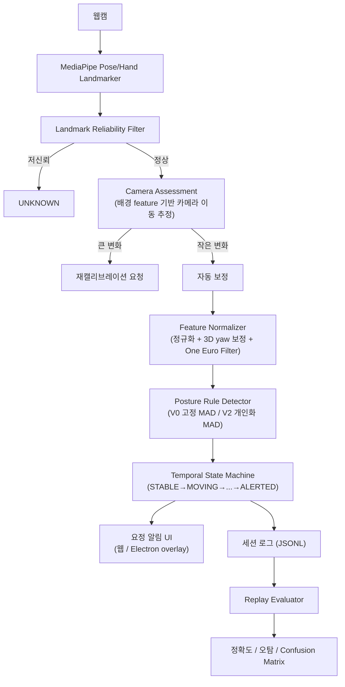

# 26s-w3-c3-06

## Build the Core
핵심 기술 문제의 해결 과정과 성능, 정확도, 안정성 등의 개선 결과를 확인할 수 있는 실행 가능한 산출물 만들기.

**산출물:** PostureCore — 웹캠 기반 개인화 자세 drift 탐지 코어 + 화면 위 요정 알림 UI ("PostureFairy")

---

## 목차

- [팀원](#팀원)
- [선택 옵션](#선택-옵션)
- [기획안](#기획안)
- [구현 명세서](#구현-명세서)
- [아키텍처](#아키텍처)
- [설계 문서](#설계-문서)
- [산출물 및 실행 방법](#산출물-및-실행-방법)
- [협업 규칙](#협업-규칙)
- [회고 문서](#회고-문서)

---

## 팀원

<!-- 이름 / 학교 / GitHub / 역할 — 직접 채워주세요 (collab.md 기준 역할은 A/B/C) -->

| 이름 | 학교 | GitHub | 역할 |
|---|---|---|---|
| 김혜리 | 한양대학교 | https://github.com/ireyhye | A (카메라/랜드마크/feature) |
| 조예준 | KAIST | https://github.com/jossi-jossi | B (profile/rule/camera 판정) |
| 정유진 | 고려대학교 | https://github.com/yujin923 | C (시간 상태/평가) |

---

## 기획안

- **프로젝트명:** PostureCore: Robust Personalized Posture Drift Detection
- **개발 기간 및 인원:** 6일, 3명 — 별도 UI 전담자 없이 세 명 모두 판정 코어와 평가 시스템 개발에 참여
- **한 줄 설명:** 웹캠에서 추출한 자세 landmark로 사용자별 기준 자세와 카메라 환경을 모델링하고, 일시적인 움직임과 지속적인 자세 이탈을 구분해 불필요한 알림을 줄이는 실시간 자세 drift 탐지 엔진

### 문제 정의

일반적인 웹캠 자세 감지는 어깨 기울기·머리 위치·얼굴 크기가 고정 임계값을 넘으면 바로 나쁜 자세로 판단한다. 하지만 실제 사용자는 키보드 잠깐 보기, 물 마시기, 옆 모니터 보기, 의자 위치 조정, 몸 숙여 물건 집기 같은 자연스러운 행동을 반복하고, landmark 변화는 자세가 아니라 노트북 화면 각도·카메라 위치 같은 환경 변화로도 발생한다. 이걸 전부 나쁜 자세로 판단하면 오탐이 반복되어 사용자가 프로그램을 신뢰하지 않게 된다.

> 사용자별 체형과 정상 자세 범위, 자연스러운 일시 행동, 제한적인 카메라 환경 변화를 고려하면서 지속적인 자세 이탈만 안정적으로 감지할 수 있는가?

### 프로젝트 목표

고정 임계값 기반 자세 감지기의 오탐을 줄이는 개인화된 자세 drift 판정 코어를 구현하고, 개선 정도를 재현 가능한 평가 방법(V0 baseline 대비 V2 비교)으로 검증한다. 의학적으로 올바른 자세를 진단하는 것이 아니라, 사용자가 calibration으로 직접 등록한 기준 자세에서 지속적으로 벗어나는지만 감지한다.

### MVP 범위

- 데스크톱 브라우저(Chrome) 웹앱 + Electron 데스크톱 앱
- MediaPipe 기반 얼굴·어깨 landmark 추출
- 사용자 1명, 기기 1대, 주 카메라 환경 1개 기준
- 카메라 정면 기준 약 30도 이내(정면)와 그 이상 벗어난 측면 캘리브레이션을 각각 지원
- 작은 카메라 거리·위치·기울기 변화는 제한적으로 자동 보정, 범위를 넘으면 경고 대신 재캘리브레이션 요청
- 원본 영상·얼굴 이미지는 저장하지 않음 — posture profile은 IndexedDB, 평가 로그는 JSONL


---

## 구현 명세서

| 구현 요소 | 설명 | 우선순위 | 상태 |
|---|---|---|---|
| Landmark reliability filter | 사람 미검출·landmark 저신뢰도·화면 이탈·좌표 점프 시 `BAD` 대신 `UNKNOWN` 처리 | 필수 | ✅ 구현 완료 |
| Feature normalizer | 어깨 중심/너비 기준으로 좌표 정규화, shoulder tilt·head offset·body scale 등 자세 feature 계산 (One Euro Filter 스무딩) | 필수 | ✅ 구현 완료 |
| 3D yaw 보정 | 측면(각도) 캘리브레이션 시 어깨 z좌표 기반으로 몸 방향을 추정해 랜드마크를 정면 기준으로 재투영 | 필수 | ✅ 구현 완료 |
| Calibration & Profile | 5초 calibration으로 사용자별 기준 자세(median) 생성, IndexedDB 저장/복원 | 필수 | ✅ 구현 완료 |
| MAD 정규화 (V0/V2) | V0는 calibration 시점 MAD 고정(baseline), V2는 안정 구간에서 MAD를 계속 개인화 | 필수 | ✅ 구현 완료 |
| Posture rule engine | 자세별 required/anyOf 조건 + 우선순위로 판정, 정면/측면 캘리브레이션마다 독립적으로 튜닝된 규칙 세트 | 필수 | ✅ 구현 완료 |
| 카메라 환경 보정 | 배경 feature 추적으로 카메라 위치·스케일 변화 추정, 작은 변화는 자동 보정·큰 변화는 재캘리브레이션 요청 | 필수 | ✅ 구현 완료 |
| 시간 상태 머신 | `STABLE → MOVING → SETTLING → DRIFT_SUSPECTED → ALERTED → RECOVERED` 흐름으로 일시 행동과 지속 drift 구분 | 필수 | ✅ 구현 완료 |
| 세션 녹화/리플레이/평가 | JSONL 녹화, 저장된 로그를 V0/V2로 리플레이해 confusion matrix·threshold 추천 산출 | 필수 | ✅ 구현 완료 |
| 요정 알림 UI (웹/Electron) | 나쁜 자세가 일정 시간 지속되면 화면 위 요정 캐릭터로 알림, 회복 시 유예시간 후 해제 | 필수 | ✅ 구현 완료 |
| 데스크톱 배포 | Electron 기반 Windows/macOS 설치 파일 빌드, 자동 업데이트 알림 | 선택 | ✅ 구현 완료 |

---

## 아키텍처

카메라 프레임에 의존하지 않는 순수 판정 코어(`src/core`)와 카메라 입력·UI를 담당하는 웹 어댑터(`src/web`)를 분리해, 같은 코어를 브라우저 웹앱과 Electron 데스크톱 앱 양쪽에서 재사용한다.



- **core** (`src/core`): feature 계산, 캘리브레이션 프로필, MAD 정규화, posture rule 판정, 시간 상태 머신 — 카메라나 DOM에 의존하지 않는 순수 로직
- **web** (`src/web`): 카메라 입력(`camera-adapter`), canvas overlay, 배경 기반 카메라 움직임 추적, IndexedDB 저장, 요정 UI, 앱 진입점(`app/`)
- **evaluation** (`src/evaluation`): 세션 녹화/리플레이, 시나리오 라벨링, threshold 스윕, 정확도 분석 — 실시간 경로와 분리된 오프라인 평가 도구

정면 캘리브레이션과 측면(각도) 캘리브레이션은 서로 다른 규칙 세트(`DEFAULT_POSTURE_RULES` / `SIDE_ANGLE_POSTURE_RULES`)로 독립적으로 튜닝된다 — 측면에서는 3D yaw 보정으로 랜드마크를 정면 기준으로 재투영한 뒤 판정한다.

---

## 설계 문서

### 좌표 정규화

원점은 양쪽 어깨 중심, 크기 기준은 양쪽 어깨 사이 거리로 잡는다. 화면 픽셀 절대 위치가 아니라 어깨 너비에 대한 상대 위치/비율을 쓰기 때문에, 사용자와 카메라 사이 거리가 변해도 자세 feature 자체는 크게 흔들리지 않는다.

### 주요 landmark / feature

- 필수 landmark: 코, 양쪽 눈(또는 귀), 양쪽 어깨
- 대표 feature: shoulder tilt(좌우 어깨 기울기), head offset(어깨 중심 대비 머리 위치), body scale(카메라와의 거리 변화), motion energy(최근 feature 변화량), pitch/yaw proxy(고개 숙임/돌림), faceToShoulderRatio(얼굴-어깨 비율, 거북목 신호) 등

### 데이터 구조 (요약)

| 구조 | 역할 | 저장 위치 |
|---|---|---|
| `FrameFeature` | 한 프레임의 정규화된 자세 feature 벡터 | (메모리, 실시간 계산) |
| `UserProfile` | calibration으로 만든 사용자 기준 자세(feature별 median) | IndexedDB |
| `MADProfile` | feature별 정상 편차(MAD) — V0는 고정, V2는 안정 구간에서 계속 개인화 | IndexedDB |
| `PostureRule` | 자세별 required/anyOf 조건, 필수 landmark, 우선순위, 알림 사유 | 코드 내 정의 (`src/core/posture-rules`) |
| `DetectionEvent` | 판정 결과 — `postureType`, `matchedFeatures`, `reason`, `score`, `alert` | 세션 로그(JSONL) |

원본 영상·얼굴 이미지는 어디에도 저장하지 않는다.

### 평가 방법

Development Session에서 자세별 threshold를 조정하고, 별도로 새로 녹화한 Test Session에서는 값을 고정한 채 검증한다. 같은 JSONL 로그를 V0(고정 threshold)와 V2(개인화 MAD)로 각각 리플레이해 시간당 오탐 수, 지속 자세 drift 탐지율, 평균 탐지 지연, confusion matrix를 비교한다.

---

## 산출물 및 실행 방법

### Getting Started

```
npm install
npm run dev         # Vite dev server (개발/디버그용 harness, index.html)
npm run lint        # eslint
npm run typecheck   # tsc --noEmit
npm run test        # vitest
npm run build       # typecheck + vite build
```

Electron 데스크톱 앱으로 실행/패키징:

```
npm run electron:dev   # Electron 개발 모드
npm run dist:win       # Windows 설치 파일 빌드 (release/)
npm run dist:mac       # macOS 설치 파일 빌드 (release/)
```

### 진입점

| 파일 | 용도 |
|---|---|
| `index.html` / `src/web/app/main.ts` | 개발/디버그용 harness — 캘리브레이션, capture 버튼, 세션 녹화/리플레이 등 튜닝 도구 포함 |
| `product.html` / `src/web/app/product-main.ts` | 실사용자용 웹 UI ("요정 — 바른 자세 코치") |
| `electron-detector.html`, `electron-overlay.html` | Electron 앱 전용 — 백그라운드 감지 + 화면 위 요정 오버레이 |

### 폴더 구조

```
src/
├── core/         # 판정 코어 — feature 계산, 캘리브레이션 프로필, posture rule 판정,
│                 # MAD 정규화, 시간 상태 머신 등 카메라 프레임에 의존하지 않는 순수 로직
├── web/          # 카메라 입력(camera-adapter), canvas overlay, 배경 기반 카메라 움직임
│                 # 추적, IndexedDB 저장, 요정 UI, 앱 진입점(app/)
└── evaluation/   # 세션 녹화(recorder)/리플레이(replay-evaluator), 시나리오 라벨링,
                  # 문턱값 스윕, 정확도 분석 등 오프라인 평가 도구
electron/         # Electron 메인/프리로드 프로세스, 배포 설정
sample-data/      # 평가용 샘플 JSONL 로그
docs/             # 설계 노트, 발표/데모 자료
```

---

## 협업 규칙

3명이 같은 코어를 병렬로 건드리는 프로젝트라 아래 규칙으로 충돌을 줄인다.

- **담당 폴더**:
  | 역할 | 담당 영역 |
  | --- | --- |
  | A | 카메라/랜드마크/feature — `src/web/camera-adapter`, `src/web/canvas-overlay`, `src/core/landmark-reliability`, `src/core/feature-normalizer`, `src/core/camera-profile` |
  | B | profile/score/camera 판정 — `src/core/profile-builder`, `src/core/fixed-threshold-detector`, `src/core/personalized-detector`, `src/web/indexeddb-storage`, 카메라 상태 판정 |
  | C | 시간 상태/평가 — `src/core/temporal-state-machine`, `src/core/feedback-generator`, `src/evaluation/*` |
  | 공용 | `src/core/types.ts`, `src/web/app/main.ts`, `sample-data/`, `docs/`, `README.md` — 필드 추가는 자유, 삭제/타입 변경은 다른 담당자에게 먼저 알리기 |


---

## 회고 문서

<!-- KPT (Keep / Problem / Try) — 직접 채워주세요 -->

### Keep

- **라이브 캡처 + 세션 리플레이 기반 검증**: threshold나 룰을 감으로 바꾸지 않고, 실제 캘리브레이션 세션을 JSONL로 녹화해서 groundTruth 라벨 기준 confusion matrix로 항상 전/후를 비교했다. 몇 개 캡처만 보고 판단했을 때 놓친 문제(예: NORMAL_WORK 오탐률)가 전체 세션 리플레이에서는 확연히 드러난 경우가 여러 번 있었다.
- **V0(고정 threshold) / V2(개인화 MAD) 병행 비교 구조**: 같은 룰을 두 가지 MAD 정책으로 동시에 돌려서, 문제가 룰 자체에 있는지 V2의 MAD 적응 과정에 있는지 구분할 수 있었다(예: ARMREST_LEAN이 V0에서는 84% 정확한데 V2에서만 3%로 무너지는 걸 확인).
- **정면/측면 캘리브레이션 규칙 완전 분리**: 처음엔 하나의 룰 세트로 두 경우를 다 처리하려다 서로의 수정이 계속 간섭했는데, `DEFAULT_POSTURE_RULES`/`SIDE_ANGLE_POSTURE_RULES`로 완전히 독립시킨 뒤로는 한쪽을 튜닝해도 다른 쪽이 깨지지 않았다.

### Problem

- **새 feature 추가 시 등록 누락으로 인한 침묵 실패**: `faceSize`라는 새 feature를 추가하면서 MAD 기본값 테이블(`mad-profile`)에 등록하는 걸 빠뜨려, 관련 룰이 계속 조건 미달로 실패하는데도 에러 없이 조용히 안 되는 상태로 한동안 테스트가 진행됐다.
- **작업 브랜치와 실제 실행 환경의 불일치**: dev 서버가 로컬 파일을 그대로 읽기 때문에, 코드를 커밋만 하고 main에 병합하지 않은 채로 "테스트해봤는데 안 고쳐졌다"는 상황이 여러 번 반복됐다. 실수로 main에 직접 커밋한 적도 있었다.
- **자세 판정 규칙 간의 feature 중복**: FORWARD_HEAD/HEAD_DOWN/SHOULDER_ASYMMETRY/TORSO_TWIST 등 서로 다른 자세가 같은 feature(faceToShoulderRatio, pitchProxy, shoulderTilt 등)에서 비슷한 값을 보이는 경우가 많아, 우선순위 기반 경쟁이 예상과 다르게 뒤집히는 문제를 여러 차례 겪었다.
- **캘리브레이션 각도에 따라 자세 신호의 부호 자체가 뒤집힘**: 같은 트위스트 동작인데도 캘리브레이션 각도/방향에 따라 어깨너비 feature가 늘어나기도 하고 줄어들기도 해서, 하나의 조건식으로 방향 무관하게 잡으려던 시도가 오히려 다른 자세와의 오탐을 늘렸다.

### Try

- TORSO_TWIST의 반대 방향(어깨너비가 줄어드는 쪽) 트위스트도 잡을 수 있는 별도 신호 찾기.
- ARMREST_LEAN이 V2에서 BACKWARD_LEAN에 먹히는 문제, HEAD_BACK/TORSO_TWIST가 서로 겹치는 문제 등 아직 남은 오탐 케이스 마저 해결.
- 제품용 진입점(`product-main.ts`, `electron-detector-main.ts`)에도 지금 dev harness에만 있는 3D yaw 보정 로직을 포팅할지 결정.
- 캘리브레이션마다 MAD가 들쭉날쭉하게 잡히는 문제의 근본 원인(세션 간 재현성)을 더 파보기.

### 팀원별 소감

**김혜리:**

> - 카메라 이용해서 계속 테스트 하는게 좀 힘들었던 것 같습니다... 까다롭더군요 그래도 해보고 싶던 거라 만족합니다!!
> - 만들면서 자세가 좋아졌어요

**조예준:**

> - 

**정유진:**

> - 
