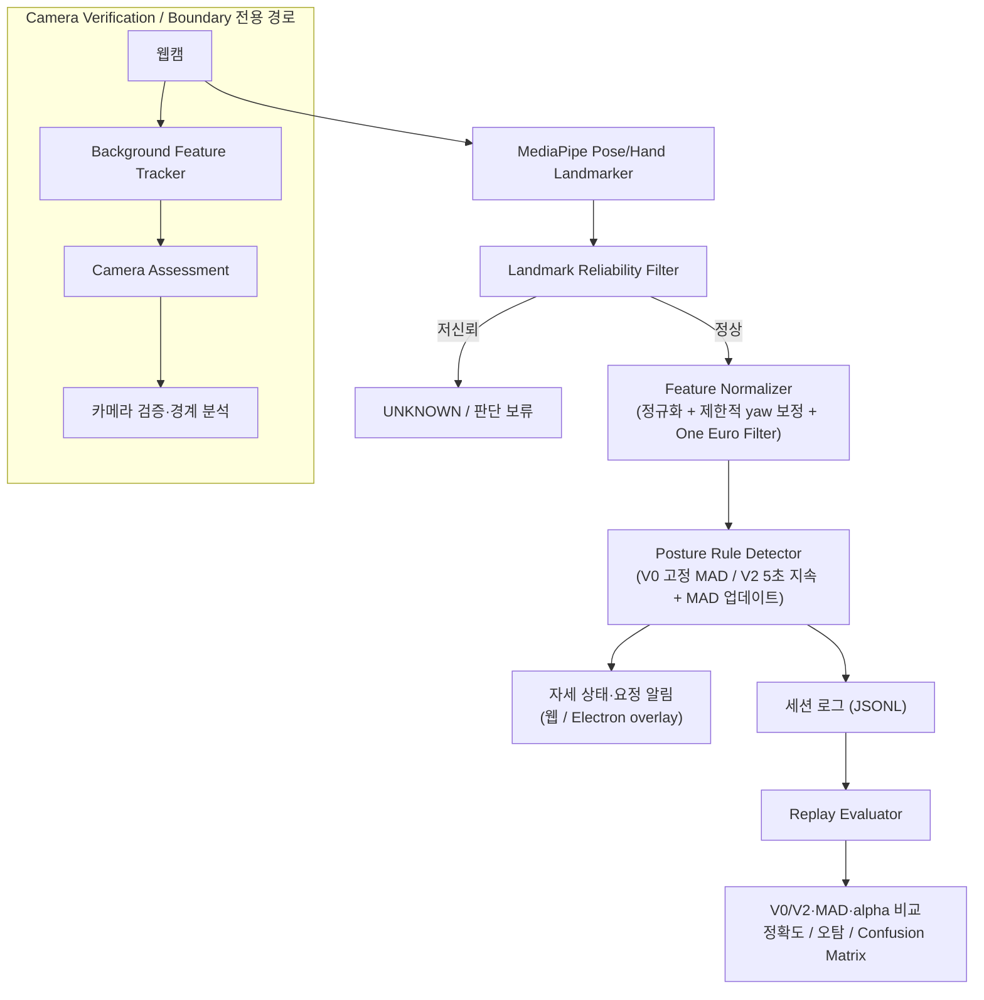

# 26s-w3-c3-06

## 공통주제 III: Build the Core
핵심 기술 문제의 해결 과정과 성능, 정확도, 안정성 등의 개선 결과를 확인할 수 있는 실행 가능한 산출물을 만들었다.

---

## 목차

- [팀원](#팀원)
- [기획안](#기획안)
- [구현 명세서](#구현-명세서)
- [아키텍처](#아키텍처)
- [설계 문서](#설계-문서)
- [산출물 및 실행 방법](#산출물-및-실행-방법)
- [시행착오](#시행착오)
- [회고 문서](#회고-문서)

---

## 팀원

<!-- 이름 / 학교 / GitHub / 역할 — 직접 채워주세요 (collab.md 기준 역할은 A/B/C) -->

| 이름 | 학교 | GitHub | 역할 |
|---|---|---|---|
| 김혜리 | 한양대학교 | https://github.com/ireyhye | 랜드마크, Feature 파이프라인, 자세 판별 개선 |
| 조예준 | KAIST | https://github.com/jossi-jossi | Profile Management, MAD 개인화, 성능 검증 |
| 정유진 | 고려대학교 | https://github.com/yujin923 | 시간 상태/평가/UI/배포 |

---

## 기획안

- **프로젝트명:** PostureCore: Robust Personalized Posture Drift Detection
- **개발 기간 및 인원:** 6일, 3명 — 세 명 모두 판정 코어와 평가 시스템 개발에 참여
- **한 줄 설명:** 웹캠에서 추출한 자세 landmark로 사용자별 기준 자세와 카메라 환경을 모델링하고, 일시적인 움직임과 지속적인 자세 이탈을 구분해 불필요한 알림을 줄이는 실시간 자세 drift 탐지 엔진으로 만들었다.

### 문제 정의

기본적인 웹캠 자세 감지는 어깨 기울기·머리 위치·얼굴 크기가 고정 임계값을 넘으면 바로 나쁜 자세로 판단했다. 하지만 실제 사용자는 키보드 잠깐 보기, 물 마시기, 옆 모니터 보기, 의자 위치 조정, 몸 숙여 물건 집기 같은 자연스러운 행동을 반복했고, landmark 변화는 자세가 아니라 노트북 화면 각도·카메라 위치 같은 환경 변화로도 발생했다. 이걸 전부 나쁜 자세로 판단하면 오탐이 반복되어 사용자가 프로그램을 신뢰하지 않게 되었다.

> 사용자별 체형과 정상 자세 범위, 자연스러운 일시 행동, 제한적인 카메라 환경 변화를 고려하면서 지속적인 자세 이탈만 안정적으로 감지할 수 있는가?

### 프로젝트 목표

고정 임계값 기반 자세 감지기의 오탐을 줄이는 개인화된 자세 drift 판정 코어를 구현했고, 개선 정도를 재현 가능한 평가 방법(V0 baseline 대비 V2 비교)으로 검증했다. 의학적으로 올바른 자세를 진단한 것이 아니라, 사용자가 calibration으로 직접 등록한 기준 자세에서 지속적으로 벗어나는지만 감지했다.

### MVP 범위

- 데스크톱 브라우저(Chrome) 웹앱과 Electron 데스크톱 앱을 제공했다.
- MediaPipe 기반 얼굴·어깨 landmark를 추출했다.
- 사용자 1명, 기기 1대, 주 카메라 환경 1개를 기준으로 했다.
- 카메라 정면 기준 약 30도 이내의 정면 캘리브레이션과 그 이상 벗어난 측면 캘리브레이션을 각각 지원했다.
- 카메라 환경 변화 자동 보정은 검증 전용으로 제한하고, 일반 자세 모드에서는 사용하지 않았다.
- 원본 영상·얼굴 이미지는 저장하지 않았고, posture profile은 IndexedDB에 저장하며 평가 로그는 JSONL로 내보냈다.


---

## 구현 명세서

| 구현 요소 | 설명 | 우선순위 | 상태 |
|---|---|---|---|
| Landmark reliability filter | 사람 미검출·landmark 저신뢰도·화면 이탈·좌표 점프 시 `UNKNOWN` 처리 | 필수 | ✅ 구현 완료 |
| Feature normalizer | 어깨 중심/너비 기준으로 좌표 정규화, shoulder tilt·head offset·body scale 등 자세 feature 계산 (One Euro Filter 스무딩) | 필수 | ✅ 구현 완료 |
| 3D yaw 보정 | 측면(각도) 캘리브레이션 시 어깨 z좌표 기반으로 몸 방향을 추정해 랜드마크를 정면 기준으로 재투영 | 필수 | ✅ 제한적 구현 완료 |
| Calibration & Profile | 5초 calibration으로 사용자별 기준 자세(median) 생성, IndexedDB 저장/복원 | 필수 | ✅ 구현 완료 |
| MAD 정규화 (V0/V2) | V0는 calibration 시점 MAD 고정(baseline), V2는 안정 구간에서 MAD를 계속 개인화 | 필수 | ✅ 구현 완료 |
| Posture rule engine | 자세별 required/anyOf 조건 + 우선순위로 판정, 정면/측면 캘리브레이션마다 독립적으로 튜닝된 규칙 세트 | 필수 | ✅ 구현 완료 |
| Rule 신뢰도·모호성 처리 | 현재 Rule에 필요한 landmark만 검사하고, 필요한 값이 불안정하거나 후보 점수가 비슷하면 해당 Rule 판정을 `UNKNOWN`으로 보류 | 필수 | ✅ 구현 완료 |
| 카메라 환경 보정 | 배경 feature 추적과 Camera Assessment·보정 코드는 있으나, 현재 일반 자세 모드에서는 비활성화되고 Camera Verification/Boundary에서만 검증 | 필수 | ⚠️ 검증 전용 |
| 시간 상태 머신 | 독립 상태 머신과 테스트는 구현되어 있으나, 실시간 판정은 PostureRuleDetector의 별도 상태·지속시간 로직을 사용하며 일부 상태 통합이 남아 있음 | 필수 | ⚠️ 부분 구현 |
| 세션 녹화/리플레이/평가 | User/MAD profile metadata와 시나리오 label을 포함한 JSONL 녹화, V0/V2 replay, confusion matrix, threshold·MAD alpha sweep 분석 구현 | 필수 | ✅ 구현 완료 |
| Development Session 자동화 | 자세·자연 행동 시나리오를 순서대로 안내하고 시작·drift·종료 시점을 자동 기록해 threshold와 MAD를 검증 | 검증 | ✅ 구현 완료 |
| Camera Session 검증 도구 | 카메라 이동·회전·거리 변화 시나리오를 안내하고 배경 추적 품질과 Camera Assessment 결과를 분석 | 검증 | ✅ 구현 완료 |
| 요정 알림 UI (웹/Electron) | 나쁜 자세가 일정 시간 지속되면 화면 위 요정 캐릭터로 알림, 회복 시 유예시간 후 해제 | 필수 | ✅ 구현 완료 |
| 세션 음성 안내 | Development/MAD 비교 세션의 시나리오 시작·종료를 텍스트와 짧은 음성으로 안내 | 선택 | ✅ 구현 완료 |
| 데스크톱 배포 | Electron 기반 Windows/macOS 설치 파일 빌드, 자동 업데이트 알림 | 선택 | ✅ 구현 완료 |

---

## 아키텍처

카메라 프레임에 의존하지 않는 순수 판정 코어(`src/core`)와 카메라 입력·UI를 담당하는 웹 어댑터(`src/web`)를 분리해, 같은 코어를 브라우저 웹앱과 Electron 데스크톱 앱 양쪽에서 재사용했다.



- **core** (`src/core`): landmark 신뢰도, feature 계산·정규화, User/MAD profile, posture rule, V0/V2 detector, camera assessment, 독립 temporal state machine 등 DOM에 의존하지 않는 판정 로직을 담당했다.
- **web** (`src/web`): 카메라 입력(`camera-adapter`), canvas overlay, IndexedDB 저장, 실사용 UI와 개발용 harness를 담당했다. 배경 feature 기반 카메라 추적은 일반 자세 모드에서 비활성화하고 Camera Verification/Boundary 모드에서만 사용했다.
- **evaluation** (`src/evaluation`): JSONL 세션 녹화, scenario labeling, replay, threshold sweep, MAD 비교, alpha sweep, camera 검증 분석 등 실시간 경로와 분리된 평가 도구를 제공했다.
- **electron** (`electron/`): 숨겨진 detector 창에서 V2 판정을 실행하고, IPC로 화면 위 요정 overlay에 알림을 전달하는 데스크톱 실행 셸을 구성했다.

정면 캘리브레이션과 측면(각도) 캘리브레이션은 서로 다른 규칙 세트(`DEFAULT_POSTURE_RULES` / `SIDE_ANGLE_POSTURE_RULES`)를 사용했다. 측면 calibration에는 yaw 기반 보정을 적용했지만, 일부 자세는 정면보다 판별 성능이 제한되는 한계가 있었다.

---

## 설계 문서

### 좌표 정규화

원점은 양쪽 어깨 중심으로 잡았고, 크기 기준은 양쪽 어깨 사이 거리로 잡았다. 화면 픽셀 절대 위치가 아니라 어깨 너비에 대한 상대 위치·비율을 사용했기 때문에, 사용자와 카메라 사이 거리가 변해도 자세 feature 자체는 크게 흔들리지 않았다.

### 주요 landmark / feature

MediaPipe Pose Landmarker의 정규화 landmark를 사용했다. 코와 양쪽 어깨는 기본 자세 feature 계산에 필요한 필수 landmark로 사용했고, 눈·귀·입은 해당 feature를 계산할 수 있을 때 사용했다. 손목·팔꿈치는 Hand Landmarker 결과가 있을 때만 손 관련 feature에 사용했다.

#### 자세 feature

모든 거리·위치 feature는 특별히 표시하지 않는 한 `shoulderWidth`로 나눈 상대값으로 계산했다. `CALIBRATION` 기준 feature는 사용자 profile의 `originalCenters`와 비교했고, `ABSOLUTE` 기준 feature는 0을 기준으로 MAD 정규화했다.

| Feature | 계산 방식 | 용도 및 비고 |
|---|---|---|
| `shoulderTilt` | 양쪽 어깨를 잇는 선의 2D 각도(도) | 어깨 기울기·비대칭 판정 |
| `headXOffset` | `(코 x - 어깨 중심 x) / shoulderWidth` | 머리의 수평 위치 변화 |
| `shoulderXOffset` | 어깨 중심의 수평 위치를 정규화한 값 | 상체의 좌우 위치 변화 보조 신호 |
| `shoulderYOffset` | 어깨 중심의 수직 위치를 정규화한 값 | 상체의 상하 위치 변화 보조 신호 |
| `bodyScale` | 양쪽 어깨 사이 거리 | 카메라와 사용자 사이 거리·화면 크기 변화 |
| `shoulderWidth` | 양쪽 어깨 사이의 2D 거리 | 다른 feature의 정규화 기준값 |
| `shoulderCenterX` | `(leftShoulder.x + rightShoulder.x) / 2` | 어깨 중심의 수평 위치 |
| `shoulderCenterY` | `(leftShoulder.y + rightShoulder.y) / 2` | 어깨 중심의 수직 위치 |
| `shoulderAsymmetry` | `(leftShoulder.y - rightShoulder.y) / shoulderWidth` | 좌우 어깨 높이 차이 |
| `headXRatio` | `(headCenterX - shoulderCenterX) / shoulderWidth` | 머리의 수평 이탈·고개 방향 보조 신호 |
| `headYRatio` | `(headCenterY - shoulderCenterY) / shoulderWidth` | 머리의 수직 이탈 |
| `headShoulderDistanceRatio` | 머리 중심과 어깨 중심의 유클리드 거리 / 어깨 너비 | 머리가 몸에서 떨어진 정도 |
| `faceToShoulderRatio` | 눈 사이 거리 / 어깨 너비 | 얼굴 크기와 어깨 폭의 상대 비율, 거북목 보조 신호 |
| `faceToShoulderRatioDelta` | 현재 `faceToShoulderRatio`와 calibration 중심의 차이 | 타입·규칙 후보로 선언되어 있으나 현재 normalizer에서 직접 산출하지 않음 |
| `faceSize` | 양쪽 눈 사이의 raw 거리 | 얼굴 자체의 크기 변화. torso twist와 카메라 접근 구분 보조 |
| `pitchProxy` | `(코 y - 눈 중심 y) / shoulderWidth` | 고개를 숙이거나 뒤로 젖힌 정도의 2D 근사값 |
| `yawProxy` | 얼굴·어깨의 좌우 관계에서 얻은 고개 회전 근사값 | 고개 회전 보조 신호. 실제 3D 각도는 아님 |
| `correctedYaw` | calibration body yaw를 기준으로 보정한 yaw 값 | 측면 calibration에서 고개 방향 판정 보조 |
| `headRoll` | 눈 또는 귀를 잇는 선의 2D 각도(도) | 고개를 옆으로 기울인 정도 |
| `faceShapeDeformation` | 얼굴 landmark의 상대적 형태 변화 | 타입·규칙 후보로 선언되어 있으나 현재 normalizer에서 산출하지 않음 |
| `forwardLeanProxy` | 머리·어깨의 상대 위치 변화에서 계산한 부호 있는 전후 기울기 근사값 | 앞으로 숙임과 뒤로 기대기를 구분 |
| `bodyCompressionRatio` | `abs(headYRatio)` 기반의 머리·어깨 수직 간격 변화 | 눕듯이 앉기 등 상체 압축 보조 신호 |
| `shoulderWidthRatio` | 현재 어깨 너비와 calibration 어깨 너비의 비율 | 어깨 폭 변화·상체 회전 보조 |
| `relativeShoulderScale` | 어깨 너비 / 눈 사이 거리 | 어깨 말림 및 torso twist 보조 |
| `shoulderDepthAsymmetry` | `(leftShoulder.z - rightShoulder.z) / shoulderWidth` | 양쪽 어깨 깊이 차이. MediaPipe z 노이즈가 커 보조 신호로만 사용 |
| `torsoRotationProxy` | shoulder tilt, shoulder width/depth 관계를 조합한 상체 회전 근사값 | 타입·규칙 후보로 선언되어 있으나 현재 normalizer에서 산출하지 않음 |
| `handFaceDistance` | 검출된 손의 손바닥 중심과 입·머리 기준점 사이 거리 / 어깨 너비 | 턱 괴기 후보. Hand Landmarker가 불안정하면 undefined |
| `handShoulderDistance` | 손바닥 중심과 어깨 중심 사이 거리 / 어깨 너비 | 팔·어깨 관계 보조. 단독 판정에는 사용하지 않음 |
| `motionEnergy` | 직전 안정화 feature와 현재 feature의 변화량 크기 | 일시적 움직임 중 자세 판정 보류 여부 판단 |
| `bodyYawAngle` | 양쪽 어깨의 x/z 관계에서 `atan2`로 추정한 몸 방향(라디안) | calibration 중 평균해 측면 자세 보정 기준으로 저장하는 보조값 |

`headCenter`는 눈 중심을 우선하고, 눈이 불안정하면 귀 중심, 마지막으로 코를 사용했다. 각 프레임의 feature는 One Euro Filter로 스무딩했고, 비정상적으로 큰 단일 프레임 점프는 제외했다. `bodyYawAngle`은 `FrameFeature`에 기록할 수 있는 calibration 보조값으로, 어깨의 x/z 관계에서 추정한 라디안 단위 몸 방향이었다.

#### 환경·품질 feature

환경 feature는 일반 자세 판정의 직접 입력이 아니라 Camera Verification/Boundary 세션과 로그 분석에서 카메라 상태와 추적 품질을 확인하는 데 사용했다.

| Feature | 계산 방식 | 용도 및 현재 상태 |
|---|---|---|
| `cameraRollProxy` | 배경 특징점 변환에서 추정한 화면 회전량 | 카메라 roll 변화 신호. 검증 경로에서 사용 |
| `cameraPitchProxy` | 배경 변환 또는 카메라 raw feature에서 추정한 상하 회전 근사값 | 카메라 pitch 변화 신호. 검증 경로에서 사용 |
| `backgroundMotion` | 배경 transform의 translation·scale·roll 변화량 조합 | 카메라 또는 배경 움직임 감지 |
| `backgroundTransformConfidence` | 배경 특징점의 추적 품질·변환 신뢰도 | 카메라 transform 사용 가능 여부 판단 |
| `landmarkCoverage` | 화면 안에서 필요한 landmark가 검출된 비율 | 화면 이탈·가림·부분 검출 확인 |
| `landmarkConfidence` | landmark visibility를 종합한 입력 신뢰도 | 품질이 낮을 때 `UNKNOWN` 처리 |
| `movementContext` | `NONE`, `CAMERA_MOVEMENT`, `ARMREST_LEAN`, `SIDE_SHIFT`, `CHAIR_MOVEMENT`, `UNKNOWN` 중 현재 움직임 맥락 | 움직임 원인 표시·로그 분석용 |
| `globalScaleDelta` | CameraProfile 대비 전역 크기 변화 | 카메라 거리 변화 분석 |
| `globalTranslationX/Y` | CameraProfile 대비 화면 전역 이동량 | 카메라 또는 화면 위치 변화 분석 |
| `cameraProfile` 값 | shoulder width, face/shoulder center, face-to-shoulder ratio, yaw/pitch proxy의 calibration 기준 | CameraProfile에 저장되는 raw 환경 기준 |

배경 특징점 기반 transform에는 `translationX/Y`, `scale`, `roll`, `yawProxy`, `pitchProxy`, `trackedPointCount`, `inlierRatio`, `reprojectionError`, `confidence`, 선택적 `affine` 행렬이 포함됐다. 다만 이 카메라 환경 pipeline은 일반 자세 모드에서 비활성화했고, Camera Verification/Boundary 모드에서만 검증했다.

### 데이터 구조

#### 실시간 판정 구조

| 구조 | 주요 필드 | 역할 및 생명주기 |
|---|---|---|
| `FrameFeature` | `timestamp`, `confidence`, 자세 feature 전체, 환경·품질 feature 일부 | 한 프레임의 계산 결과. 메모리에서 detector·MAD updater·logger로 전달 |
| `FeatureVector` | `PostureFeatureName`을 key로 하는 선택적 number map | profile 중심값, MAD 값, 정규화 결과를 공통 형태로 표현 |
| `LandmarkQuality` | `personPresent`, `faceInFrame`, `shouldersInFrame`, `confidence`, `reliable`, `landmarkCoverage`, `occlusionRate`, missing/unreliable 목록 | 전체 프레임 또는 Rule별 landmark 신뢰도 판단. 불안정하면 해당 Rule 판정을 보류 |
| `UserProfile` | `originalCenters`, `adaptiveCenters`, `featureDeviations`, `calibrationDuration`, `validFrameCount`, `profileCreatedAt` | 5초 calibration에서 feature별 중심값을 median으로 만들고 저장. V0/V2 모두 기준 자세로 사용 |
| `MADProfile` | `values`, `min`, `max`, `initializedAt`, `updatedAt`, `updateCount` | feature별 정상 변화 폭. V0는 초기값을 고정하고, V2는 안정 구간의 window MAD를 EMWA로 업데이트하며 min/max로 제한 |
| `PostureRule` | `postureType`, `requiredLandmarks`, `required`, `anyOf`, `supporting`, `reason`, `priority` | 자세별 판정 계약. 모든 required 조건과 anyOf 중 하나를 만족해야 후보가 된다 |
| `PostureRuleCondition` | `feature`, `operator`, `threshold`, `reference` | feature 하나의 비교 방식. `GT/GTE/LT/LTE/ABS_GT/ABS_LT`, `CALIBRATION/ABSOLUTE`를 지원 |
| `DetectionEvent` | `timestamp`, `state`, `alert`, `reason`, `postureType`, `matchedFeatures`, `postureCandidates`, camera/quality 정보 | 한 프레임의 자세 판정 결과. V0는 즉시 판정하고 V2는 5초 지속 조건을 적용 |
| `DriftObservation` | `timestamp`, `driftScore`, `reliability`, `dominantFeatures` | drift score 기반 관찰 결과를 전달하는 공통 구조 |

#### 카메라·저장 구조

| 구조 | 주요 필드 | 역할 및 저장 위치 |
|---|---|---|
| `CameraRawFeature` | `shoulderWidth`, face/shoulder center, `faceToShoulderRatio`, `yawProxy`, `pitchProxy` | calibration과 현재 프레임의 raw 카메라 관련 값 |
| `CameraProfile` | `CameraRawFeature`의 calibration 기준값 | IndexedDB에 저장. 현재 카메라 raw 값과의 delta 계산에 사용 |
| `CameraDelta` | `globalScaleDelta`, `globalTranslationX/Y`, `correctedYaw` | CameraProfile 대비 현재 raw 값의 차이 |
| `CameraTransform` | translation, scale, roll, yaw/pitch proxy, 추적점 수, inlier ratio, reprojection error, confidence, affine | 배경 특징점에서 추정한 프레임별 카메라 변환 |
| `CameraAssessment` | `state`, correction 값, `reliability`, reason, transform, motion/quality 상태 | `VALID`, `ADJUSTED`, `RECALIBRATION_REQUIRED`, `UNKNOWN`으로 카메라 검증 결과 표현 |
| `StoredProfiles` | `userProfile`, `cameraProfile`, `madProfile`, `lastCalibrationAt`, `backgroundReference` | IndexedDB `posture-core/profiles/default`에 저장·복원 |
| `BackgroundReference` | calibration 시 캡처한 배경 특징점 기준 | Camera Verification/Boundary에서 현재 화면 비교에 사용 |

#### JSONL 세션 로그 구조

`SessionLogEntry`는 한 줄에 한 프레임을 저장했다. 첫 프레임에만 `metadata`를 포함해 해당 세션의 calibration snapshot을 보존했고, 영상·얼굴 이미지는 저장하지 않았다.

| 필드 | 내용 |
|---|---|
| `timestamp` | 프레임 시각(ms) |
| `metadata` | `userProfile`, `cameraProfile`, 선택적 `madProfile`, `profileCreatedAt`, `sessionType` |
| `groundTruth` | 조작자가 지정한 `NORMAL_WORK`, 자세·자연 행동·카메라 시나리오 label |
| `cameraState` | 해당 프레임의 카메라 상태 문자열 |
| `cameraTransform` / `cameraAssessment` | Camera 세션에서만 기록되는 transform·품질·판정 정보 |
| `postureEvent` | V0 또는 실시간 V2 자세 판정 결과 |
| `comparison` | MAD 비교 세션의 V0 event, V2 event, MAD update count, 당시 V2 MAD 값 |
| `confidence` / `features` | 프레임 신뢰도와 `FrameFeature`에서 timestamp/confidence를 제외한 feature map |
| `markers` | `SCENARIO_STARTED`, `DRIFT_ONSET`, `CHANGE_ONSET`, `SCENARIO_ENDED` 시점과 label |

### 평가 방법

현재 주된 평가는 별도 Test Session이 아니라 실제로 녹화한 Development/MAD Comparison JSONL을 같은 입력으로 replay하는 방식으로 진행했다.

1. **세션 구성**: `NORMAL_WORK`와 자연 행동 구간을 먼저 기록하고, 자세별로 `SCENARIO_STARTED → DRIFT_ONSET → SCENARIO_ENDED` marker를 남겼다. 자연 행동은 사용자 관점에서 알림이 없어야 하는 정상 구간으로 함께 집계했다.
2. **V0/V2 비교**: 같은 feature와 UserProfile에 V0(고정 MAD)와 V2(5초 지속 + 안정 구간 MAD 업데이트)를 각각 적용했다. V2는 MAD update ON/OFF를 추가로 비교했다.
3. **threshold 분석**: posture threshold sweep으로 자세별 threshold 조합을 replay하고, 정상 구간 오탐을 늘리지 않으면서 자세 탐지 성능이 높은 후보를 찾았다.
4. **MAD 분석**: alpha sweep으로 EMWA 가중치를 바꿔 V2를 재실행하고, feature별 초기 MAD·최종 MAD·업데이트 횟수를 비교했다.

주요 지표는 다음과 같다.

| 범주 | 지표 |
|---|---|
| 나쁜 자세 탐지 | 전체 자세 탐지율, 자세별 탐지 여부, 올바른 자세 판단률, 탐지 프레임 비율, 올바른 판단 프레임 비율 |
| 정상 구간 안정성 | 정상 구간 `alert=true` 전환 횟수, 정상 구간 오탐 프레임률, 자연 행동 오탐률 및 오탐 에피소드 수 |
| 판정 품질 | 자세별 오판 프레임 수, 자세 후보 혼동 행렬 |
| 개인화 효과 | MAD 업데이트 횟수, feature별 초기 MAD 대비 최종 MAD 변화율, MAD 업데이트 전후 오탐·탐지율 |
| 카메라 검증 | 시나리오 탐지율, tracked point 수, inlier ratio, reprojection error, 방향 정확도, recovery rate |

V2에 5초 지속 조건이 적용되어 있으므로 비교의 중심은 탐지 지연이 아니라 `탐지를 놓치지 않는가`, `정상·자연 행동에 불필요한 알림을 줄이는가`, `자세를 다른 자세로 혼동하지 않는가`를 확인하는 데 두었다. Test Session은 최종 고정값을 별도 데이터로 확인하는 후속 단계로 남겨두었으며, 아직 본 평가 결과에는 포함하지 않았다.

---

## 산출물 및 실행 방법

### 앱 다운로드해서 바로 쓰기 (개발 환경 없이)

아래 GitHub Releases에서 설치 파일만 받으면 됩니다.

**다운로드**: https://github.com/madcamp-official/Into-the-Deep/releases/latest

- 🪟 **Windows** → `PostureFairy-Setup-{버전}.exe`
- 🍎 **macOS** (Intel / Apple Silicon 공용) → `PostureFairy-{버전}-universal.dmg`

(`Source code`, `.blockmap`, `latest*.yml`은 자동 업데이트용/GitHub가 자동으로 붙이는 파일이라 무시해도 됩니다.)

**설치 및 사용법**

Windows
1. `PostureFairy-Setup-{버전}.exe` 실행 → 설치 진행
2. "Windows가 PC를 보호했습니다" 경고가 뜨면 **추가 정보 → 실행** (코드 서명이 없어서 뜨는 정상적인 경고입니다)
3. 카메라 권한 허용
4. 저장된 프로필이 없으면 자동으로 캘리브레이션 창이 뜹니다 — 안내에 따라 3단계 진행

macOS
1. `PostureFairy-{버전}-universal.dmg` 더블클릭 → 앱을 Applications 폴더로 드래그
2. Applications에서 **우클릭(또는 Control+클릭) → 열기** (그냥 더블클릭하면 "확인되지 않은 개발자" 경고로 막힙니다 — 최초 1회만 이렇게 열어주면 됩니다)
3. 카메라 권한 허용
4. 저장된 프로필이 없으면 자동으로 캘리브레이션 창이 뜹니다 — 안내에 따라 3단계 진행

**설치 후**

- 컴퓨터를 켤 때마다 자동으로 백그라운드 실행됩니다 (Windows 트레이 / macOS 메뉴바 아이콘으로 확인 가능)
- 나쁜 자세가 몇 초 유지되면 화면 우상단에 요정이 나타나고, 자세가 교정될 때까지 유지됩니다
- 다시 캘리브레이션하려면: 트레이/메뉴바 아이콘 우클릭 → "캘리브레이션 시작"
- 현재 설치된 버전 확인: 트레이 아이콘에 마우스를 올리거나 우클릭 (예: `v0.1.10`)
- **Windows는 이후 업데이트가 자동으로 적용됩니다** — 새 버전을 백그라운드로 받아뒀다가, 트레이의 "종료"로 앱을 완전히 껐다 다시 켤 때 반영됩니다 (절전모드로 껐다 켜는 것만으로는 적용되지 않습니다 — 앱 프로세스가 실제로 종료돼야 합니다)
- **macOS는 코드 서명 인증서가 없어 자동 설치까지는 안 되고**, 새 버전이 올라오면 요정이 "새 버전이 나왔어요" 알림을 띄웁니다 — 눌러서 열리는 GitHub 페이지에서 새 dmg를 받아 설치 과정을 다시 진행해주세요
- 카메라가 이상하게 나오면: 다른 화상회의 앱이나 브라우저 탭이 카메라를 이미 쓰고 있지 않은지 확인 (웹캠은 동시에 한 프로그램만 접근 가능)

### 개발 환경에서 실행하기

코드를 직접 빌드/디버깅하고 싶을 때는 아래 경로를 따라주세요.

### Getting Started

```
npm install
npm run dev         # Vite dev server (개발/디버그용 harness, index.html)
npm run lint        # eslint
npm run typecheck   # tsc --noEmit
npm run test        # vitest
npm run build       # typecheck + vite build
```

Electron 데스크톱 앱으로 실행/패키징:

```
npm run electron:dev   # Electron 개발 모드
npm run dist:win       # Windows 설치 파일 빌드 (release/)
npm run dist:mac       # macOS 설치 파일 빌드 (release/)
```

### 진입점

| 파일 | 용도 |
|---|---|
| `index.html` / `src/web/app/main.ts` | 개발/디버그용 harness — 캘리브레이션, capture 버튼, 세션 녹화/리플레이 등 튜닝 도구 포함 |
| `product.html` / `src/web/app/product-main.ts` | 실사용자용 웹 UI ("요정 — 바른 자세 코치") |
| `electron-detector.html`, `electron-overlay.html` | Electron 앱 전용 — 백그라운드 감지 + 화면 위 요정 오버레이 |

### 폴더 구조

```
index.html                 # 개발/검증용 웹 harness 진입점
product.html               # 실사용 웹앱 진입점
electron-detector.html     # Electron 백그라운드 detector 창
electron-overlay.html      # Electron 화면 위 overlay 창
public/                    # 웹앱 정적 자산·아이콘
src/
├── core/         # 판정 코어 — feature 계산, 캘리브레이션 프로필, posture rule 판정,
│                 # MAD 정규화, 시간 상태 머신 등 카메라 프레임에 의존하지 않는 순수 로직
├── web/          # 카메라 입력(camera-adapter), canvas overlay, 배경 기반 카메라 움직임
│                 # 추적, IndexedDB 저장, 요정 UI, 앱 진입점(app/)
└── evaluation/   # 세션 녹화(recorder)/리플레이(replay-evaluator), 시나리오 라벨링,
                  # 문턱값 스윕, 정확도 분석 등 오프라인 평가 도구
electron/         # Electron 메인/프리로드 프로세스와 배포 설정
build/            # 패키징에 사용하는 앱 아이콘
sample-data/      # 평가용 샘플 JSONL 로그
docs/
├── planning/     # 전체 계획, 3일 병렬 개발 계획
├── design/       # feature·공통 결정사항
├── team/         # 협업 규칙, A/B/C 작업 구조
└── diagrams/     # 발표·구조도 이미지와 Mermaid 원본
```

---

## 시행착오

### 카메라 위치·각도 변화 자동 인식 및 보정 시도

사용 중 카메라 환경이 바뀌거나 마지막 calibration 이후 다른 환경에서 프로그램을 시작하는 경우를 처리하기 위해 카메라 변화 자동 인식·보정 기능을 시도했다.

- 카메라의 좌우·상하 이동, 화면 각도 변경, 제자리 회전, 사용자를 중심으로 한 회전, 카메라와 사용자의 거리 변화 등을 시나리오로 구성했다.
- 랜드마크 변화만으로는 사용자가 움직인 것과 카메라가 움직인 것을 구분하기 어렵다고 판단해 화면 속 배경 고정 지점을 추적하는 방식을 도입했다.
- calibration 당시 배경을 기준으로 저장한 뒤 현재 화면과 비교하고, 배경 변화가 감지되면 카메라의 `translation`, `scale`, `roll`, `yaw`, `pitch` 등의 `CameraTransform`을 추정하려 했다.
- 추정된 transform의 역변환을 현재 랜드마크에 적용해 자세 feature를 calibration 기준에 맞추고, 변화량에 따라 보정 불필요·보정 가능·재측정 필요 범위로 구분하려 했다.
- 사용 중 카메라가 이동하는 경우에는 이동 중 자세 판정을 보류하고, 이동이 끝난 뒤 안정화된 프레임과 이전 keyframe을 비교하는 방식도 시도했다. 시작 시에는 저장된 calibration 배경과 현재 화면을 비교해 환경 변화를 확인하도록 분리했다.
- 실제 세션에서는 배경 추적점 수가 부족해지거나 추적점의 신뢰도·inlier ratio가 낮아지고, reprojection error가 크게 변하는 문제가 반복됐다. 카메라가 회전하면 기존 배경 지점이 화면 밖으로 사라지고 새로운 지점이 나타나 transform을 안정적으로 계산하기 어려웠다.
- transform 값이 실제 카메라 이동 방향과 일치하는지, 이를 이용해 랜드마크를 보정한 뒤 calibration 기준으로 돌아오는지를 세션 로그로 검증했지만, 변화 유형별 탐지율과 방향 정확도가 충분히 안정적이지 않았다.
- 결국 일반 사용 모드에서 카메라 위치·각도 변화를 자동으로 인식하고 보정하는 기능은 오탐과 미탐 위험이 커 실사용 기능으로 채택하지 않았다. Camera Verification과 Boundary Session은 검증 도구로 유지하고, 일반 자세 판정 경로에서는 카메라 환경 pipeline을 비활성화했다.
- 대신 카메라 환경 변화가 있을 때 자주 발생하는 `TORSO_TWIST`, `FORWARD_HEAD` 알림에 별도 안내를 추가해 사용자가 카메라 위치나 각도를 확인하고 필요하면 다시 calibration하도록 보완했다.

### 3D 좌표 활용 시도와 한계

측면 캘리브레이션 문제를 해결하기 위해 랜드마크의 z좌표(카메라와의 상대 깊이)를 활용해 몸의 회전각(yaw)을 매 프레임 추정해보았다. 하지만 같은 자세를 유지해도 추정값이 최대 27도까지 흔들릴 정도로 불안정했다. z좌표가 x/y좌표보다 노이즈가 커, 프레임마다 재추정하는 대신 캘리브레이션 구간에서 여러 프레임의 값을 평균 내 하나의 고정 각도로 확정하고 실사용 중에는 그 값을 사용하도록 축소했다. 다른 z 기반 신호도 단독 판정 조건이 아닌 보조 신호로만 남겼고, 핵심 판정 로직은 대부분 x/y 기반 2D 계산에 의존하게 되었다.

### 랜드마크 범위의 물리적 제약

책상 위에 놓고 사용하는 노트북 웹캠은 카메라와 사용자의 거리가 가까워 상반신 전체가 아니라 얼굴과 어깨까지만 안정적으로 프레임에 들어왔다. 골반 랜드마크는 책상이나 키보드에 가려지거나 화면 밖으로 나가는 경우가 잦아 신뢰도가 낮았다. 그 결과 골반 기반 feature는 제외하고 얼굴·어깨 중심의 자세 판정으로 범위를 좁혔다.

### 측면 캘리브레이션의 근본적인 보정 한계

정면 캘리브레이션에서는 대부분의 자세가 안정적으로 판정되었지만, 측면 캘리브레이션에서는 캘리브레이션 각도와 트위스트 방향에 따라 어깨 너비 변화량 같은 feature의 부호가 바뀌는 현상이 나타났다. 정면 규칙을 그대로 적용하기 어려워 측면 전용 규칙 세트를 분리했지만, 완벽한 보정에는 도달하지 못했다. 이에 따라 일부 자세는 한쪽 방향만 인식하는 제한을 허용했다.

### 개인화가 정확도를 떨어뜨리는 경우

고정 기준(V0)과 계속 적응하는 개인화 기준(V2)을 같은 로그에서 비교한 결과, 일부 자세는 V2에서 성능이 크게 떨어졌다. 예를 들어 팔걸이 기대기는 84%에서 3%, 거북목은 87%에서 49%로 감소한 사례가 있었다. 개인화가 항상 정확도를 높이는 것은 아니며, 세션 중 MAD가 드리프트하면 오히려 판정이 불안정해질 수 있음을 확인했다.

### 우선순위 조정만으로는 한계가 있었음

서로 다른 자세가 같은 feature에서 비슷한 값을 보일 때 규칙 우선순위를 조정해 해결하려 했다. 그러나 일부 자세 쌍은 우선순위를 조정해도 특정 값에서 판정이 급격히 뒤집혔다. 결국 우선순위만 조정하는 대신 두 자세를 실제로 구분할 수 있는 feature를 추가하거나, 구분이 어려운 자세를 비활성화하는 방향을 선택했다.

### 하드웨어 레벨의 제약: 자동 노출 문제

고개를 숙이면 화면에 책상 같은 어두운 영역이 많아져 웹캠의 자동 노출이 과도하게 올라가고 화면이 하얗게 날아가는 문제가 발생했다. 이 경우 소프트웨어 판정 로직 이전에 랜드마크 인식 자체가 실패하므로, 현재 코드만으로 완전히 해결하기 어려운 하드웨어·촬영 환경의 한계로 기록했다.

### 자주 사용하지 않는 자세가 다른 자세 인식을 흔드는 트레이드오프

고개 돌림은 초기에는 오탐이 잦아 비활성화했다가, 알림만 억제하는 방식으로 다시 적용했다. 이후 트위스트 동작에 고개 회전이 섞이면 우선순위 경쟁에서 다른 자세를 이기는 문제가 발생해 다시 비활성화했다. 자주 사용하지 않는 자세 하나가 더 중요한 자세의 판정을 흔들 수 있다는 트레이드오프를 확인했다.

---

## 회고 문서

<!-- KPT (Keep / Problem / Try) — 직접 채워주세요 -->

### Keep — 잘 된 점, 다음에도 유지할 것

- **라이브 캡처 + 세션 리플레이 기반 검증**: threshold나 룰을 감으로 바꾸지 않고, 실제 캘리브레이션 세션을 JSONL로 녹화해서 groundTruth 라벨 기준 confusion matrix로 항상 전/후를 비교했다.
- **V0(고정 threshold) / V2(개인화 MAD) 병행 비교 구조**: 같은 룰을 두 가지 MAD 정책으로 동시에 돌려서, 문제가 룰 자체에 있는지 V2의 MAD 적응 과정에 있는지 구분할 수 있었다.
- **수정 후 회귀 검증**: 기능을 고친 뒤 `typecheck`와 Vitest를 실행하고, ambiguity 분기 수정에는 회귀 방지 테스트 2개를 추가해 기존 동작이 깨지지 않았는지 확인했다.

### Problem — 아쉬웠던 점, 개선이 필요한 것

- **자세 판정 규칙 간의 feature 중복**: FORWARD_HEAD/HEAD_DOWN/SHOULDER_ASYMMETRY/TORSO_TWIST 등 서로 다른 자세가 같은 feature(faceToShoulderRatio, pitchProxy, shoulderTilt 등)에서 비슷한 값을 보이는 경우가 많아, 우선순위 기반 경쟁이 예상과 다르게 뒤집히는 문제를 여러 차례 겪었다.
- **카메라 환경 자동 보정의 한계**: 배경 특징점으로 카메라 위치·각도 변화를 추정하고 랜드마크를 보정하려 했지만, 추적점 부족과 transform 불안정으로 실사용 기능으로 채택하지 못했다. 카메라 환경 변화까지 자동으로 처리해 불필요한 자세 알림을 줄이려던 목표를 완전히 달성하지 못한 점이 아쉬웠다.
- **기능 적용 여부 확인의 지연**: 새 기능이 실제 배포물에 반영됐는지 확인하는 방법을 기능과 함께 만들지 않아, 배포 문제를 겪은 뒤에야 트레이 버전 표시를 추가했다.

### Try — 다음번에 시도해볼 것

- **구현 가능성 사전 검증**: 핵심 기능을 개발하기 전에 필요한 입력 데이터, landmark 검출 범위, 하드웨어 제약, 오탐 가능성을 먼저 확인하고 작은 프로토타입으로 실현 가능성을 검증했어야 했다. 구현이 어려운 기능은 초기 단계에서 대체안과 중단 기준까지 정했어야 했다.
- **성능 평가 프로세스 사전 설계**: 기능을 구현한 뒤 지표를 정하는 대신, 정상·자연 행동·나쁜 자세 시나리오와 ground truth 기록 방법을 먼저 정했어야 했다. 같은 로그를 V0와 V2에 적용하고 탐지율, 정상 구간 오탐률, 자세 혼동, MAD 변화율을 일관되게 비교하는 평가 절차를 개발 초기에 설계했어야 했다.
- **배포 파이프라인 문서화**: 커밋부터 push, 태그, CI, 릴리즈, auto-update까지의 흐름을 README나 별도 문서에 정리해 다음 작업에서 팀원이 같은 과정을 반복해서 확인하지 않도록 해야 했다.
- **영향 범위가 큰 작업의 사전 확인**: 태그 릴리즈, `origin/main` push, 커밋 시점처럼 되돌리기 어려운 작업은 실행 전에 팀과 확인하는 절차를 유지해 배포와 전체 브랜치에 영향을 주는 실수를 줄여야 했다.

### 팀원별 소감

**김혜리:**

> - 평소에 카메라를 통해 모션을 캡쳐하고, Mediapipe를 이용해보고 싶다고 생각했었는데 이번 기회에 다루게 되어서 좋았습니다. 거북목이 심하다고 생각했었는데, 이번 개발을 하며 자세가 많이 좋아진 것 같습니다. 자세 feature 추출을 하면서 사실 노가다도 많이했지만… 많은 걸 얻어갈 수 있는 기회였던 것 같습니다. 

**조예준:**

> - 1,2주차에 게임을 개발해서 다른 분야의 주제를 하고 싶던 와중, Mediapipe를 사용하여 자세를 판별하는 처음 경험해보는 분야의 주제를 진행하게 되어 좋았습니다. 비록 중간에 기획서를 수정하고, 처음에 목표로 세웠던 기능을 완전히 구현하지 못하거나 포기하게 되어서 힘들었지만, 그와 동시에 시행착오에서 배울 수 있는 여러 점들을 몸소 느낄 수 있어 유익했다. 

**정유진:**

> - 웹 개발만 진행해보고 앱은 개발해본 적이 없었는데, electron을 통해 데스크탑용 앱을 만들어 볼 수 있어서 좋았습니다. 또한 시간 판별 로직을 구현하고, 모션 로직을 공부하면서 많은 것을 배울 수 있었습니다. 개발을 하면서 자세가 많이 안 좋아졌는데, 이 앱을 통해 자세를 계속 신경쓰고 교정할 수 있어서 의미있었습니다.
