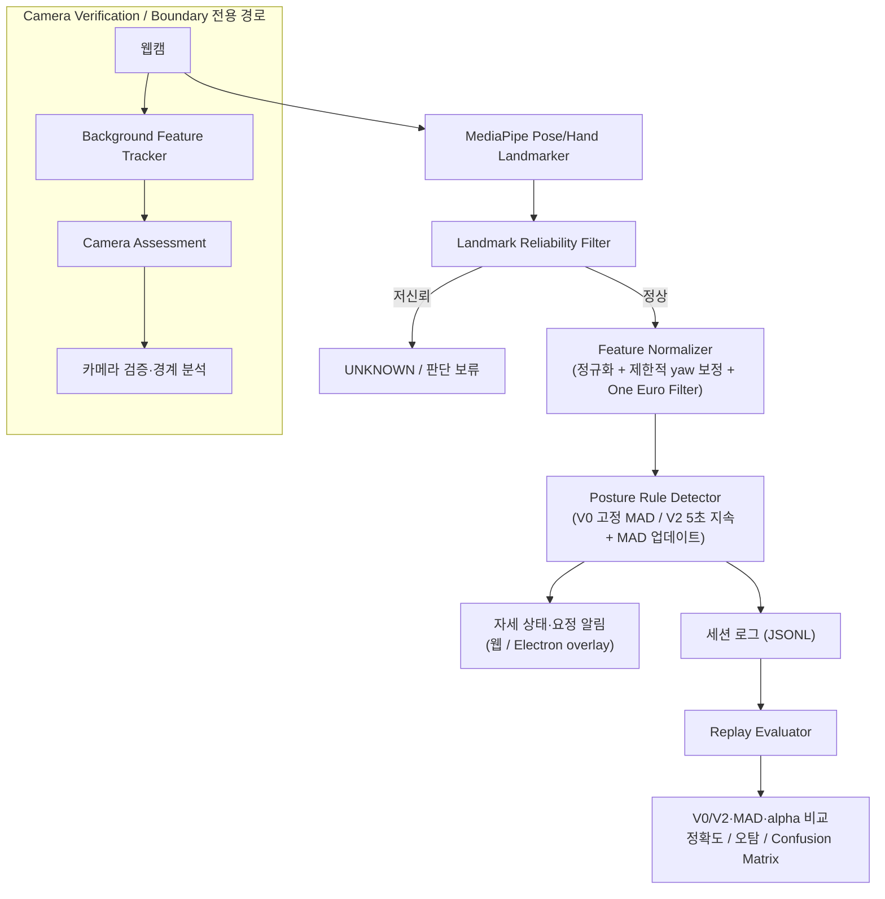

# 26s-w3-c3-06

## 공통주제 III: Build the Core
핵심 기술 문제의 해결 과정과 성능, 정확도, 안정성 등의 개선 결과를 확인할 수 있는 실행 가능한 산출물 만들기.

---

## 목차

- [팀원](#팀원)
- [선택 옵션](#선택-옵션)
- [기획안](#기획안)
- [구현 명세서](#구현-명세서)
- [아키텍처](#아키텍처)
- [설계 문서](#설계-문서)
- [산출물 및 실행 방법](#산출물-및-실행-방법)
- [협업 규칙](#협업-규칙)
- [회고 문서](#회고-문서)

---

## 팀원

<!-- 이름 / 학교 / GitHub / 역할 — 직접 채워주세요 (collab.md 기준 역할은 A/B/C) -->

| 이름 | 학교 | GitHub | 역할 |
|---|---|---|---|
| 김혜리 | 한양대학교 | https://github.com/ireyhye | 랜드마크, Feature 파이프라인, 자세 판별 개선 |
| 조예준 | KAIST | https://github.com/jossi-jossi | Profile Management, MAD 개인화, 성능 검증 |
| 정유진 | 고려대학교 | https://github.com/yujin923 | 시간 상태/평가/UI/배포 |

---

## 기획안

- **프로젝트명:** PostureCore: Robust Personalized Posture Drift Detection
- **개발 기간 및 인원:** 6일, 3명 — 세 명 모두 판정 코어와 평가 시스템 개발에 참여
- **한 줄 설명:** 웹캠에서 추출한 자세 landmark로 사용자별 기준 자세와 카메라 환경을 모델링하고, 일시적인 움직임과 지속적인 자세 이탈을 구분해 불필요한 알림을 줄이는 실시간 자세 drift 탐지 엔진

### 문제 정의

기본적인 웹캠 자세 감지는 어깨 기울기·머리 위치·얼굴 크기가 고정 임계값을 넘으면 바로 나쁜 자세로 판단한다. 하지만 실제 사용자는 키보드 잠깐 보기, 물 마시기, 옆 모니터 보기, 의자 위치 조정, 몸 숙여 물건 집기 같은 자연스러운 행동을 반복하고, landmark 변화는 자세가 아니라 노트북 화면 각도·카메라 위치 같은 환경 변화로도 발생한다. 이걸 전부 나쁜 자세로 판단하면 오탐이 반복되어 사용자가 프로그램을 신뢰하지 않게 된다.

> 사용자별 체형과 정상 자세 범위, 자연스러운 일시 행동, 제한적인 카메라 환경 변화를 고려하면서 지속적인 자세 이탈만 안정적으로 감지할 수 있는가?

### 프로젝트 목표

고정 임계값 기반 자세 감지기의 오탐을 줄이는 개인화된 자세 drift 판정 코어를 구현하고, 개선 정도를 재현 가능한 평가 방법(V0 baseline 대비 V2 비교)으로 검증한다. 의학적으로 올바른 자세를 진단하는 것이 아니라, 사용자가 calibration으로 직접 등록한 기준 자세에서 지속적으로 벗어나는지만 감지한다.

### MVP 범위

- 데스크톱 브라우저(Chrome) 웹앱 + Electron 데스크톱 앱
- MediaPipe 기반 얼굴·어깨 landmark 추출
- 사용자 1명, 기기 1대, 주 카메라 환경 1개 기준
- 카메라 정면 기준 약 30도 이내(정면)와 그 이상 벗어난 측면 캘리브레이션을 각각 지원
- 작은 카메라 거리·위치·기울기 변화는 제한적으로 자동 보정, 범위를 넘으면 경고 대신 재캘리브레이션 요청
- 원본 영상·얼굴 이미지는 저장하지 않음 — posture profile은 IndexedDB, 평가 로그는 JSONL


---

## 구현 명세서

| 구현 요소 | 설명 | 우선순위 | 상태 |
|---|---|---|---|
| Landmark reliability filter | 사람 미검출·landmark 저신뢰도·화면 이탈·좌표 점프 시 `UNKNOWN` 처리 | 필수 | ✅ 구현 완료 |
| Feature normalizer | 어깨 중심/너비 기준으로 좌표 정규화, shoulder tilt·head offset·body scale 등 자세 feature 계산 (One Euro Filter 스무딩) | 필수 | ✅ 구현 완료 |
| 3D yaw 보정 | 측면(각도) 캘리브레이션 시 어깨 z좌표 기반으로 몸 방향을 추정해 랜드마크를 정면 기준으로 재투영 | 필수 | ✅ 제한적 구현 완료 |
| Calibration & Profile | 5초 calibration으로 사용자별 기준 자세(median) 생성, IndexedDB 저장/복원 | 필수 | ✅ 구현 완료 |
| MAD 정규화 (V0/V2) | V0는 calibration 시점 MAD 고정(baseline), V2는 안정 구간에서 MAD를 계속 개인화 | 필수 | ✅ 구현 완료 |
| Posture rule engine | 자세별 required/anyOf 조건 + 우선순위로 판정, 정면/측면 캘리브레이션마다 독립적으로 튜닝된 규칙 세트 | 필수 | ✅ 구현 완료 |
| Rule 신뢰도·모호성 처리 | 현재 Rule에 필요한 landmark만 검사하고, 필요한 값이 불안정하거나 후보 점수가 비슷하면 해당 Rule 판정을 `UNKNOWN`으로 보류 | 필수 | ✅ 구현 완료 |
| 카메라 환경 보정 | 배경 feature 추적과 Camera Assessment·보정 코드는 있으나, 현재 일반 자세 모드에서는 비활성화되고 Camera Verification/Boundary에서만 검증 | 필수 | ⚠️ 검증 전용 |
| 시간 상태 머신 | 독립 상태 머신과 테스트는 구현되어 있으나, 실시간 판정은 PostureRuleDetector의 별도 상태·지속시간 로직을 사용하며 일부 상태 통합이 남아 있음 | 필수 | ⚠️ 부분 구현 |
| 세션 녹화/리플레이/평가 | User/MAD profile metadata와 시나리오 label을 포함한 JSONL 녹화, V0/V2 replay, confusion matrix, threshold·MAD alpha sweep 분석 구현 | 필수 | ✅ 구현 완료 |
| Development Session 자동화 | 자세·자연 행동 시나리오를 순서대로 안내하고 시작·drift·종료 시점을 자동 기록해 threshold와 MAD를 검증 | 검증 | ✅ 구현 완료 |
| Camera Session 검증 도구 | 카메라 이동·회전·거리 변화 시나리오를 안내하고 배경 추적 품질과 Camera Assessment 결과를 분석 | 검증 | ✅ 구현 완료 |
| 요정 알림 UI (웹/Electron) | 나쁜 자세가 일정 시간 지속되면 화면 위 요정 캐릭터로 알림, 회복 시 유예시간 후 해제 | 필수 | ✅ 구현 완료 |
| 세션 음성 안내 | Development/MAD 비교 세션의 시나리오 시작·종료를 텍스트와 짧은 음성으로 안내 | 선택 | ✅ 구현 완료 |
| 데스크톱 배포 | Electron 기반 Windows/macOS 설치 파일 빌드, 자동 업데이트 알림 | 선택 | ✅ 구현 완료 |

---

## 아키텍처

카메라 프레임에 의존하지 않는 순수 판정 코어(`src/core`)와 카메라 입력·UI를 담당하는 웹 어댑터(`src/web`)를 분리해, 같은 코어를 브라우저 웹앱과 Electron 데스크톱 앱 양쪽에서 재사용한다.



- **core** (`src/core`): landmark 신뢰도, feature 계산·정규화, User/MAD profile, posture rule, V0/V2 detector, camera assessment, 독립 temporal state machine 등 DOM에 의존하지 않는 판정 로직
- **web** (`src/web`): 카메라 입력(`camera-adapter`), canvas overlay, IndexedDB 저장, 실사용 UI와 개발용 harness. 배경 feature 기반 카메라 추적은 현재 일반 자세 모드에서는 비활성화되어 Camera Verification/Boundary 모드에서만 사용
- **evaluation** (`src/evaluation`): JSONL 세션 녹화, scenario labeling, replay, threshold sweep, MAD 비교, alpha sweep, camera 검증 분석 등 실시간 경로와 분리된 평가 도구
- **electron** (`electron/`): 숨겨진 detector 창에서 V2 판정을 실행하고, IPC로 화면 위 요정 overlay에 알림을 전달하는 데스크톱 실행 셸

정면 캘리브레이션과 측면(각도) 캘리브레이션은 서로 다른 규칙 세트(`DEFAULT_POSTURE_RULES` / `SIDE_ANGLE_POSTURE_RULES`)를 사용한다. 측면 calibration에는 yaw 기반 보정이 적용되지만, 일부 자세는 정면보다 판별 성능이 제한되는 현재 한계가 있다.

---

## 설계 문서

### 좌표 정규화

원점은 양쪽 어깨 중심, 크기 기준은 양쪽 어깨 사이 거리로 잡는다. 화면 픽셀 절대 위치가 아니라 어깨 너비에 대한 상대 위치/비율을 쓰기 때문에, 사용자와 카메라 사이 거리가 변해도 자세 feature 자체는 크게 흔들리지 않는다.

### 주요 landmark / feature

MediaPipe Pose Landmarker의 정규화 landmark를 사용한다. 코와 양쪽 어깨는 기본 자세 feature 계산에 필요한 필수 landmark이고, 눈·귀·입은 해당 feature를 계산할 수 있을 때 사용한다. 손목·팔꿈치는 Hand Landmarker 결과가 있을 때만 손 관련 feature를 계산한다.

#### 자세 feature

모든 거리·위치 feature는 특별히 표시하지 않는 한 `shoulderWidth`로 나눈 상대값이다. `CALIBRATION` 기준 feature는 사용자 profile의 `originalCenters`와 비교하고, `ABSOLUTE` 기준 feature는 0을 기준으로 MAD 정규화한다.

| Feature | 계산 방식 | 용도 및 비고 |
|---|---|---|
| `shoulderTilt` | 양쪽 어깨를 잇는 선의 2D 각도(도) | 어깨 기울기·비대칭 판정 |
| `headXOffset` | `(코 x - 어깨 중심 x) / shoulderWidth` | 머리의 수평 위치 변화 |
| `shoulderXOffset` | 어깨 중심의 수평 위치를 정규화한 값 | 상체의 좌우 위치 변화 보조 신호 |
| `shoulderYOffset` | 어깨 중심의 수직 위치를 정규화한 값 | 상체의 상하 위치 변화 보조 신호 |
| `bodyScale` | 양쪽 어깨 사이 거리 | 카메라와 사용자 사이 거리·화면 크기 변화 |
| `shoulderWidth` | 양쪽 어깨 사이의 2D 거리 | 다른 feature의 정규화 기준값 |
| `shoulderCenterX` | `(leftShoulder.x + rightShoulder.x) / 2` | 어깨 중심의 수평 위치 |
| `shoulderCenterY` | `(leftShoulder.y + rightShoulder.y) / 2` | 어깨 중심의 수직 위치 |
| `shoulderAsymmetry` | `(leftShoulder.y - rightShoulder.y) / shoulderWidth` | 좌우 어깨 높이 차이 |
| `headXRatio` | `(headCenterX - shoulderCenterX) / shoulderWidth` | 머리의 수평 이탈·고개 방향 보조 신호 |
| `headYRatio` | `(headCenterY - shoulderCenterY) / shoulderWidth` | 머리의 수직 이탈 |
| `headShoulderDistanceRatio` | 머리 중심과 어깨 중심의 유클리드 거리 / 어깨 너비 | 머리가 몸에서 떨어진 정도 |
| `faceToShoulderRatio` | 눈 사이 거리 / 어깨 너비 | 얼굴 크기와 어깨 폭의 상대 비율, 거북목 보조 신호 |
| `faceToShoulderRatioDelta` | 현재 `faceToShoulderRatio`와 calibration 중심의 차이 | 타입·규칙 후보로 선언되어 있으나 현재 normalizer에서 직접 산출하지 않음 |
| `faceSize` | 양쪽 눈 사이의 raw 거리 | 얼굴 자체의 크기 변화. torso twist와 카메라 접근 구분 보조 |
| `pitchProxy` | `(코 y - 눈 중심 y) / shoulderWidth` | 고개를 숙이거나 뒤로 젖힌 정도의 2D 근사값 |
| `yawProxy` | 얼굴·어깨의 좌우 관계에서 얻은 고개 회전 근사값 | 고개 회전 보조 신호. 실제 3D 각도는 아님 |
| `correctedYaw` | calibration body yaw를 기준으로 보정한 yaw 값 | 측면 calibration에서 고개 방향 판정 보조 |
| `headRoll` | 눈 또는 귀를 잇는 선의 2D 각도(도) | 고개를 옆으로 기울인 정도 |
| `faceShapeDeformation` | 얼굴 landmark의 상대적 형태 변화 | 타입·규칙 후보로 선언되어 있으나 현재 normalizer에서 산출하지 않음 |
| `forwardLeanProxy` | 머리·어깨의 상대 위치 변화에서 계산한 부호 있는 전후 기울기 근사값 | 앞으로 숙임과 뒤로 기대기를 구분 |
| `bodyCompressionRatio` | `abs(headYRatio)` 기반의 머리·어깨 수직 간격 변화 | 눕듯이 앉기 등 상체 압축 보조 신호 |
| `shoulderWidthRatio` | 현재 어깨 너비와 calibration 어깨 너비의 비율 | 어깨 폭 변화·상체 회전 보조 |
| `relativeShoulderScale` | 어깨 너비 / 눈 사이 거리 | 어깨 말림 및 torso twist 보조 |
| `shoulderDepthAsymmetry` | `(leftShoulder.z - rightShoulder.z) / shoulderWidth` | 양쪽 어깨 깊이 차이. MediaPipe z 노이즈가 커 보조 신호로만 사용 |
| `torsoRotationProxy` | shoulder tilt, shoulder width/depth 관계를 조합한 상체 회전 근사값 | 타입·규칙 후보로 선언되어 있으나 현재 normalizer에서 산출하지 않음 |
| `handFaceDistance` | 검출된 손의 손바닥 중심과 입·머리 기준점 사이 거리 / 어깨 너비 | 턱 괴기 후보. Hand Landmarker가 불안정하면 undefined |
| `handShoulderDistance` | 손바닥 중심과 어깨 중심 사이 거리 / 어깨 너비 | 팔·어깨 관계 보조. 단독 판정에는 사용하지 않음 |
| `motionEnergy` | 직전 안정화 feature와 현재 feature의 변화량 크기 | 일시적 움직임 중 자세 판정 보류 여부 판단 |
| `bodyYawAngle` | 양쪽 어깨의 x/z 관계에서 `atan2`로 추정한 몸 방향(라디안) | calibration 중 평균해 측면 자세 보정 기준으로 저장하는 보조값 |

`headCenter`는 눈 중심을 우선하고, 눈이 불안정하면 귀 중심, 마지막으로 코를 사용한다. 각 프레임의 feature는 One Euro Filter로 스무딩되며, 비정상적으로 큰 단일 프레임 점프는 제외된다. `bodyYawAngle`은 `FrameFeature`에 기록될 수 있는 calibration 보조값으로, 어깨의 x/z 관계에서 추정한 라디안 단위 몸 방향이다.

#### 환경·품질 feature

환경 feature는 현재 일반 자세 판정의 직접 입력이 아니라, Camera Verification/Boundary 세션과 로그 분석에서 카메라 상태와 추적 품질을 확인하는 데 사용한다.

| Feature | 계산 방식 | 용도 및 현재 상태 |
|---|---|---|
| `cameraRollProxy` | 배경 특징점 변환에서 추정한 화면 회전량 | 카메라 roll 변화 신호. 검증 경로에서 사용 |
| `cameraPitchProxy` | 배경 변환 또는 카메라 raw feature에서 추정한 상하 회전 근사값 | 카메라 pitch 변화 신호. 검증 경로에서 사용 |
| `backgroundMotion` | 배경 transform의 translation·scale·roll 변화량 조합 | 카메라 또는 배경 움직임 감지 |
| `backgroundTransformConfidence` | 배경 특징점의 추적 품질·변환 신뢰도 | 카메라 transform 사용 가능 여부 판단 |
| `landmarkCoverage` | 화면 안에서 필요한 landmark가 검출된 비율 | 화면 이탈·가림·부분 검출 확인 |
| `landmarkConfidence` | landmark visibility를 종합한 입력 신뢰도 | 품질이 낮을 때 `UNKNOWN` 처리 |
| `movementContext` | `NONE`, `CAMERA_MOVEMENT`, `ARMREST_LEAN`, `SIDE_SHIFT`, `CHAIR_MOVEMENT`, `UNKNOWN` 중 현재 움직임 맥락 | 움직임 원인 표시·로그 분석용 |
| `globalScaleDelta` | CameraProfile 대비 전역 크기 변화 | 카메라 거리 변화 분석 |
| `globalTranslationX/Y` | CameraProfile 대비 화면 전역 이동량 | 카메라 또는 화면 위치 변화 분석 |
| `cameraProfile` 값 | shoulder width, face/shoulder center, face-to-shoulder ratio, yaw/pitch proxy의 calibration 기준 | CameraProfile에 저장되는 raw 환경 기준 |

배경 특징점 기반 transform에는 `translationX/Y`, `scale`, `roll`, `yawProxy`, `pitchProxy`, `trackedPointCount`, `inlierRatio`, `reprojectionError`, `confidence`, 선택적 `affine` 행렬이 포함된다. 다만 이 카메라 환경 pipeline은 현재 일반 자세 모드에서 비활성화되어 있으며, Camera Verification/Boundary 모드에서만 검증한다.

### 데이터 구조

#### 실시간 판정 구조

| 구조 | 주요 필드 | 역할 및 생명주기 |
|---|---|---|
| `FrameFeature` | `timestamp`, `confidence`, 자세 feature 전체, 환경·품질 feature 일부 | 한 프레임의 계산 결과. 메모리에서 detector·MAD updater·logger로 전달 |
| `FeatureVector` | `PostureFeatureName`을 key로 하는 선택적 number map | profile 중심값, MAD 값, 정규화 결과를 공통 형태로 표현 |
| `LandmarkQuality` | `personPresent`, `faceInFrame`, `shouldersInFrame`, `confidence`, `reliable`, `landmarkCoverage`, `occlusionRate`, missing/unreliable 목록 | 전체 프레임 또는 Rule별 landmark 신뢰도 판단. 불안정하면 해당 Rule 판정을 보류 |
| `UserProfile` | `originalCenters`, `adaptiveCenters`, `featureDeviations`, `calibrationDuration`, `validFrameCount`, `profileCreatedAt` | 5초 calibration에서 feature별 중심값을 median으로 만들고 저장. V0/V2 모두 기준 자세로 사용 |
| `MADProfile` | `values`, `min`, `max`, `initializedAt`, `updatedAt`, `updateCount` | feature별 정상 변화 폭. V0는 초기값을 고정하고, V2는 안정 구간의 window MAD를 EMWA로 업데이트하며 min/max로 제한 |
| `PostureRule` | `postureType`, `requiredLandmarks`, `required`, `anyOf`, `supporting`, `reason`, `priority` | 자세별 판정 계약. 모든 required 조건과 anyOf 중 하나를 만족해야 후보가 된다 |
| `PostureRuleCondition` | `feature`, `operator`, `threshold`, `reference` | feature 하나의 비교 방식. `GT/GTE/LT/LTE/ABS_GT/ABS_LT`, `CALIBRATION/ABSOLUTE`를 지원 |
| `DetectionEvent` | `timestamp`, `state`, `alert`, `reason`, `postureType`, `matchedFeatures`, `postureCandidates`, camera/quality 정보 | 한 프레임의 자세 판정 결과. V0는 즉시 판정하고 V2는 5초 지속 조건을 적용 |
| `DriftObservation` | `timestamp`, `driftScore`, `reliability`, `dominantFeatures` | drift score 기반 관찰 결과를 전달하는 공통 구조 |

#### 카메라·저장 구조

| 구조 | 주요 필드 | 역할 및 저장 위치 |
|---|---|---|
| `CameraRawFeature` | `shoulderWidth`, face/shoulder center, `faceToShoulderRatio`, `yawProxy`, `pitchProxy` | calibration과 현재 프레임의 raw 카메라 관련 값 |
| `CameraProfile` | `CameraRawFeature`의 calibration 기준값 | IndexedDB에 저장. 현재 카메라 raw 값과의 delta 계산에 사용 |
| `CameraDelta` | `globalScaleDelta`, `globalTranslationX/Y`, `correctedYaw` | CameraProfile 대비 현재 raw 값의 차이 |
| `CameraTransform` | translation, scale, roll, yaw/pitch proxy, 추적점 수, inlier ratio, reprojection error, confidence, affine | 배경 특징점에서 추정한 프레임별 카메라 변환 |
| `CameraAssessment` | `state`, correction 값, `reliability`, reason, transform, motion/quality 상태 | `VALID`, `ADJUSTED`, `RECALIBRATION_REQUIRED`, `UNKNOWN`으로 카메라 검증 결과 표현 |
| `StoredProfiles` | `userProfile`, `cameraProfile`, `madProfile`, `lastCalibrationAt`, `backgroundReference` | IndexedDB `posture-core/profiles/default`에 저장·복원 |
| `BackgroundReference` | calibration 시 캡처한 배경 특징점 기준 | Camera Verification/Boundary에서 현재 화면 비교에 사용 |

#### JSONL 세션 로그 구조

`SessionLogEntry`는 한 줄에 한 프레임을 저장한다. 첫 프레임에만 `metadata`를 포함해 해당 세션의 calibration snapshot을 보존하고, 영상·얼굴 이미지는 저장하지 않는다.

| 필드 | 내용 |
|---|---|
| `timestamp` | 프레임 시각(ms) |
| `metadata` | `userProfile`, `cameraProfile`, 선택적 `madProfile`, `profileCreatedAt`, `sessionType` |
| `groundTruth` | 조작자가 지정한 `NORMAL_WORK`, 자세·자연 행동·카메라 시나리오 label |
| `cameraState` | 해당 프레임의 카메라 상태 문자열 |
| `cameraTransform` / `cameraAssessment` | Camera 세션에서만 기록되는 transform·품질·판정 정보 |
| `postureEvent` | V0 또는 실시간 V2 자세 판정 결과 |
| `comparison` | MAD 비교 세션의 V0 event, V2 event, MAD update count, 당시 V2 MAD 값 |
| `confidence` / `features` | 프레임 신뢰도와 `FrameFeature`에서 timestamp/confidence를 제외한 feature map |
| `markers` | `SCENARIO_STARTED`, `DRIFT_ONSET`, `CHANGE_ONSET`, `SCENARIO_ENDED` 시점과 label |

### 평가 방법

현재 주된 평가는 별도 Test Session이 아니라 실제로 녹화한 Development/MAD Comparison JSONL을 같은 입력으로 replay하는 방식이다.

1. **세션 구성**: `NORMAL_WORK`와 자연 행동 구간을 먼저 기록하고, 자세별로 `SCENARIO_STARTED → DRIFT_ONSET → SCENARIO_ENDED` marker를 남긴다. 자연 행동은 사용자 관점에서 알림이 없어야 하는 정상 구간으로 함께 집계한다.
2. **V0/V2 비교**: 같은 feature와 UserProfile에 V0(고정 MAD)와 V2(5초 지속 + 안정 구간 MAD 업데이트)를 각각 적용한다. V2는 MAD update ON/OFF를 추가로 비교한다.
3. **threshold 분석**: posture threshold sweep으로 자세별 threshold 조합을 replay하고, 정상 구간 오탐을 늘리지 않으면서 자세 탐지 성능이 높은 후보를 찾는다.
4. **MAD 분석**: alpha sweep으로 EMWA 가중치를 바꿔 V2를 재실행하고, feature별 초기 MAD·최종 MAD·업데이트 횟수를 비교한다.

주요 지표는 다음과 같다.

| 범주 | 지표 |
|---|---|
| 나쁜 자세 탐지 | 전체 자세 탐지율, 자세별 탐지 여부, 올바른 자세 판단률, 탐지 프레임 비율, 올바른 판단 프레임 비율 |
| 정상 구간 안정성 | 정상 구간 `alert=true` 전환 횟수, 정상 구간 오탐 프레임률, 자연 행동 오탐률 및 오탐 에피소드 수 |
| 판정 품질 | 자세별 오판 프레임 수, 자세 후보 혼동 행렬 |
| 개인화 효과 | MAD 업데이트 횟수, feature별 초기 MAD 대비 최종 MAD 변화율, MAD 업데이트 전후 오탐·탐지율 |
| 카메라 검증 | 시나리오 탐지율, tracked point 수, inlier ratio, reprojection error, 방향 정확도, recovery rate |

V2에 5초 지속 조건이 적용되어 있으므로 현재 비교의 중심은 탐지 지연이 아니라 `탐지를 놓치지 않는가`, `정상·자연 행동에 불필요한 알림을 줄이는가`, `자세를 다른 자세로 혼동하지 않는가`이다. Test Session은 최종 고정값을 별도 데이터로 확인하는 후속 단계로 남겨두며, 아직 본 평가 결과에는 포함하지 않는다.

---

## 산출물 및 실행 방법

### 앱 다운로드해서 바로 쓰기 (개발 환경 없이)

아래 GitHub Releases에서 설치 파일만 받으면 됩니다.

**다운로드**: https://github.com/madcamp-official/Into-the-Deep/releases/latest

- 🪟 **Windows** → `PostureFairy-Setup-{버전}.exe`
- 🍎 **macOS** (Intel / Apple Silicon 공용) → `PostureFairy-{버전}-universal.dmg`

(`Source code`, `.blockmap`, `latest*.yml`은 자동 업데이트용/GitHub가 자동으로 붙이는 파일이라 무시해도 됩니다.)

**설치 및 사용법**

Windows
1. `PostureFairy-Setup-{버전}.exe` 실행 → 설치 진행
2. "Windows가 PC를 보호했습니다" 경고가 뜨면 **추가 정보 → 실행** (코드 서명이 없어서 뜨는 정상적인 경고입니다)
3. 카메라 권한 허용
4. 저장된 프로필이 없으면 자동으로 캘리브레이션 창이 뜹니다 — 안내에 따라 3단계 진행

macOS
1. `PostureFairy-{버전}-universal.dmg` 더블클릭 → 앱을 Applications 폴더로 드래그
2. Applications에서 **우클릭(또는 Control+클릭) → 열기** (그냥 더블클릭하면 "확인되지 않은 개발자" 경고로 막힙니다 — 최초 1회만 이렇게 열어주면 됩니다)
3. 카메라 권한 허용
4. 저장된 프로필이 없으면 자동으로 캘리브레이션 창이 뜹니다 — 안내에 따라 3단계 진행

**설치 후**

- 컴퓨터를 켤 때마다 자동으로 백그라운드 실행됩니다 (Windows 트레이 / macOS 메뉴바 아이콘으로 확인 가능)
- 나쁜 자세가 몇 초 유지되면 화면 우상단에 요정이 나타나고, 자세가 교정될 때까지 유지됩니다
- 다시 캘리브레이션하려면: 트레이/메뉴바 아이콘 우클릭 → "캘리브레이션 시작"
- 현재 설치된 버전 확인: 트레이 아이콘에 마우스를 올리거나 우클릭 (예: `v0.1.10`)
- **Windows는 이후 업데이트가 자동으로 적용됩니다** — 새 버전을 백그라운드로 받아뒀다가, 트레이의 "종료"로 앱을 완전히 껐다 다시 켤 때 반영됩니다 (절전모드로 껐다 켜는 것만으로는 적용되지 않습니다 — 앱 프로세스가 실제로 종료돼야 합니다)
- **macOS는 코드 서명 인증서가 없어 자동 설치까지는 안 되고**, 새 버전이 올라오면 요정이 "새 버전이 나왔어요" 알림을 띄웁니다 — 눌러서 열리는 GitHub 페이지에서 새 dmg를 받아 설치 과정을 다시 진행해주세요
- 카메라가 이상하게 나오면: 다른 화상회의 앱이나 브라우저 탭이 카메라를 이미 쓰고 있지 않은지 확인 (웹캠은 동시에 한 프로그램만 접근 가능)

### 개발 환경에서 실행하기

코드를 직접 빌드/디버깅하고 싶을 때는 아래 경로를 따라주세요.

### Getting Started

```
npm install
npm run dev         # Vite dev server (개발/디버그용 harness, index.html)
npm run lint        # eslint
npm run typecheck   # tsc --noEmit
npm run test        # vitest
npm run build       # typecheck + vite build
```

Electron 데스크톱 앱으로 실행/패키징:

```
npm run electron:dev   # Electron 개발 모드
npm run dist:win       # Windows 설치 파일 빌드 (release/)
npm run dist:mac       # macOS 설치 파일 빌드 (release/)
```

### 진입점

| 파일 | 용도 |
|---|---|
| `index.html` / `src/web/app/main.ts` | 개발/디버그용 harness — 캘리브레이션, capture 버튼, 세션 녹화/리플레이 등 튜닝 도구 포함 |
| `product.html` / `src/web/app/product-main.ts` | 실사용자용 웹 UI ("요정 — 바른 자세 코치") |
| `electron-detector.html`, `electron-overlay.html` | Electron 앱 전용 — 백그라운드 감지 + 화면 위 요정 오버레이 |

### 폴더 구조

```
index.html                 # 개발/검증용 웹 harness 진입점
product.html               # 실사용 웹앱 진입점
electron-detector.html     # Electron 백그라운드 detector 창
electron-overlay.html      # Electron 화면 위 overlay 창
public/                    # 웹앱 정적 자산·아이콘
src/
├── core/         # 판정 코어 — feature 계산, 캘리브레이션 프로필, posture rule 판정,
│                 # MAD 정규화, 시간 상태 머신 등 카메라 프레임에 의존하지 않는 순수 로직
├── web/          # 카메라 입력(camera-adapter), canvas overlay, 배경 기반 카메라 움직임
│                 # 추적, IndexedDB 저장, 요정 UI, 앱 진입점(app/)
└── evaluation/   # 세션 녹화(recorder)/리플레이(replay-evaluator), 시나리오 라벨링,
                  # 문턱값 스윕, 정확도 분석 등 오프라인 평가 도구
electron/         # Electron 메인/프리로드 프로세스와 배포 설정
build/            # 패키징에 사용하는 앱 아이콘
sample-data/      # 평가용 샘플 JSONL 로그
docs/
├── planning/     # 전체 계획, 3일 병렬 개발 계획
├── design/       # feature·공통 결정사항
├── team/         # 협업 규칙, A/B/C 작업 구조
└── diagrams/     # 발표·구조도 이미지와 Mermaid 원본
```

---

## 회고 문서

<!-- KPT (Keep / Problem / Try) — 직접 채워주세요 -->

### Keep — 잘 된 점, 다음에도 유지할 것

- **라이브 캡처 + 세션 리플레이 기반 검증**: threshold나 룰을 감으로 바꾸지 않고, 실제 캘리브레이션 세션을 JSONL로 녹화해서 groundTruth 라벨 기준 confusion matrix로 항상 전/후를 비교함
- **V0(고정 threshold) / V2(개인화 MAD) 병행 비교 구조**: 같은 룰을 두 가지 MAD 정책으로 동시에 돌려서, 문제가 룰 자체에 있는지 V2의 MAD 적응 과정에 있는지 구분할 수 있었음.

### Problem — 아쉬웠던 점, 개선이 필요한 것

- **자세 판정 규칙 간의 feature 중복**: FORWARD_HEAD/HEAD_DOWN/SHOULDER_ASYMMETRY/TORSO_TWIST 등 서로 다른 자세가 같은 feature(faceToShoulderRatio, pitchProxy, shoulderTilt 등)에서 비슷한 값을 보이는 경우가 많아, 우선순위 기반 경쟁이 예상과 다르게 뒤집히는 문제를 여러 차례 겪었다.

### Try — 다음번에 시도해볼 것

### 팀원별 소감

**김혜리:**

> - 카메라 이용해서 계속 테스트 하는게 좀 힘들었던 것 같습니다... 까다롭더군요 그래도 해보고 싶던 거라 만족합니다!!
> - 만들면서 자세가 좋아졌어요

**조예준:**

> - 

**정유진:**

> - 
