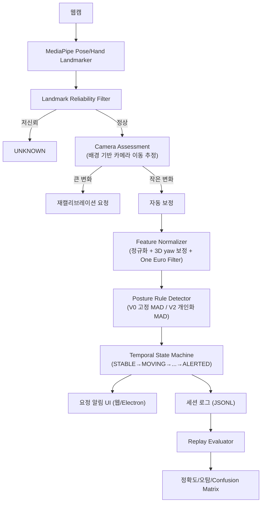

# 🧘 PostureFairy

## **PostureCore: Robust Personalized Posture Drift Detection**

- 노트북 웹캠 하나로 나만의 기준 자세를 학습하고, 거기서 지속적으로 벗어난 순간에만 알려주는 실시간 자세 코치 시스템

> **GitHub:** https://github.com/madcamp-official/Into-the-Deep
> 

> **몇 도 기울었는지가 아니라, 얼마나 오래 그 자세였는지를 봅니다.**
> 
> 
> PostureFairy는 의학적으로 정해진 "바른 자세"를 강요하지 않습니다. 캘리브레이션으로 등록한 사용자 본인의 기준 자세를 기억하고, 물 마시기·잠깐 고개 숙이기 같은 자연스러운 움직임은 넘어가면서, 진짜로 오래 지속된 자세 이탈만 화면 위 요정이 짚어줍니다.
> 

---

## 👥 팀원

**🦉 김혜리 - 한양대학교**

**:: Feature Engineering (카메라·랜드마크·자세 feature)**

📷 MediaPipe 기반 랜드마크 추출 및 신뢰도(landmark reliability) 필터링

🧮 어깨/머리 기준 좌표 정규화, 자세 feature 계산(shoulder tilt, head offset, body scale 등), One Euro Filter 스무딩

🛠️ 측면(각도) 캘리브레이션을 위한 3D yaw 보정 — 어깨 z좌표로 몸 방향을 추정해 랜드마크를 정면 기준으로 재투영

**🐿️ 조예준 - KAIST**

**:: Profile & Rule Engine (판정 코어)**

📊 캘리브레이션 기반 사용자 프로필 생성(feature별 median), MAD 정규화(V0 고정 / V2 개인화)

⚙️ 자세별 판정 규칙(posture rule) 설계 — required/anyOf 조건, 우선순위, 정면/측면 캘리브레이션별 독립 튜닝

🔔 배경 feature 기반 카메라 환경 변화 감지, 자동 보정과 재캘리브레이션 요청 판단

**🦔 정유진 - 고려대학교**

**:: Temporal State & Evaluation (시간 상태·평가)**

🖥️ `STABLE → MOVING → SETTLING → DRIFT_SUSPECTED → ALERTED → RECOVERED` 시간 상태 머신

🎨 세션 녹화(JSONL)·리플레이·정확도 평가(confusion matrix, threshold sweep) 파이프라인

🚀 요정 알림 UI, 웹/Electron 배포

---

## 🔎 서비스 소개

> **"몇 도 기울었는지가 아니라, 얼마나 오래 그 자세였는지를 봅니다."**
> 

**PostureFairy**는 일반 웹캠으로 사용자의 어깨·머리 랜드마크를 분석하여, 사용자가 직접 등록한 기준 자세에서 얼마나 오래 벗어나 있었는지를 판단해 알려주는 **개인화된 실시간 자세 drift 탐지 시스템**입니다.

작업 중 자연스럽게 일어나는 행동 — 키보드를 잠깐 내려다보기, 물 마시기, 옆 모니터 확인하기, 의자 위치 조정 — 은 알림 대상이 아닙니다. 예를 들어 다음처럼 작동합니다.

- 고개를 잠깐 숙였다가 1~2초 안에 원래대로 돌아오면 알림을 띄우지 않습니다.
- 거북목·기대기·몸통 트위스트 같은 자세가 일정 시간(초 단위) 이상 지속되면 화면 위 요정이 알려줍니다.
- 카메라나 노트북 화면의 작은 위치·각도 변화는 자동으로 보정하고, 보정 범위를 넘으면 자세 경고 대신 재캘리브레이션을 요청하도록 확장돼 있습니다.

PostureFairy의 핵심은 단순히 "어깨가 기울었다/안 기울었다"를 나열하는 게 아니라, **개인별 정상 자세 분포·자연스러운 일시 행동·카메라 환경 변화**를 함께 분석해 **지속적인 자세 이탈만 안정적으로 짚어내는 것**입니다.

---

## 💡 기획 배경 — 왜 이런 시스템이 필요할까?

일반적인 웹캠 자세 감지는 어깨 기울기·머리 위치·얼굴 크기 같은 값이 고정 임계값을 넘으면 곧바로 "나쁜 자세"로 판단합니다.

| 비교 항목 | 기존 방식의 한계 |
| --- | --- |
| 판단 기준 | 모든 사용자에게 동일한 고정 임계값 적용 — 체형·습관 차이를 반영하지 못함 |
| 일시적 행동 | 물 마시기, 잠깐 고개 숙이기 같은 자연스러운 동작도 그대로 "나쁜 자세"로 오탐 |
| 카메라 환경 변화 | 노트북 화면 각도, 카메라 위치가 조금만 변해도 자세가 바뀐 것으로 착각 |

이런 방식은 오탐이 반복되고, 사용자는 결국 알림을 끄거나 프로그램 자체를 신뢰하지 않게 됩니다.

```
무엇을 볼 것인가?   → 사용자별 기준 자세에서의 상대적 이탈 (절대적인 "바른 자세" 아님)
어떻게 판단할 것인가? → 일시적 움직임 vs 지속적 drift를 시간 흐름으로 구분
무엇을 무시할 것인가? → 자연스러운 일시 행동, 제한적인 카메라 환경 변화
```

이 구조를 통해 사용자는 자신에게 맞는 기준으로, 정말 오래 지속된 자세 문제만 알림 받습니다.

---

## 🧩 문제 정의

### 🎯 개인차를 반영하지 못하는 고정 임계값

> 모든 사람의 체형과 평소 자세가 다른데 하나의 임계값으로 판단할 수 있는가?
> 

사용자가 캘리브레이션으로 등록한 자기 자신의 기준 자세(median)와, 그 기준에서의 정상 편차(MAD)를 기반으로 개인화된 임계값을 계산합니다.

### ✋ 일시적 행동과 지속적 이탈의 구분

> 잠깐 고개를 숙인 것과 계속 숙이고 있는 것을 어떻게 구분할까?
> 

시간 상태 머신(STABLE → MOVING → ... → ALERTED)으로 자세 변화가 일정 시간 이상 지속돼야만 알림으로 이어지도록 했습니다.

### 🔗 카메라·환경 변화와 자세 변화의 혼동

> 노트북을 조금 옮겼을 뿐인데 자세가 나빠진 것처럼 보이는 문제를 어떻게 풀까?
> 

배경 feature를 추적해 카메라 자체의 위치·스케일 변화를 추정하고, 작은 변화는 자동 보정, 큰 변화는 재캘리브레이션을 요청합니다.

### 🛡️ 측면 각도 캘리브레이션에서의 오탐

> 카메라를 정면이 아니라 측면에 두고 캘리브레이션하면 판정이 완전히 틀어지지 않을까?
> 

어깨 z좌표 기반으로 몸의 실제 방향(yaw)을 추정해 랜드마크를 정면 기준으로 재투영하고, 정면/측면 캘리브레이션을 완전히 독립된 규칙 세트로 분리해 각각 튜닝했습니다.

---

## 🚀 서비스 핵심 가치

### 1. 개인화된 기준

의학적으로 정해진 "바른 자세"가 아니라, 사용자가 직접 등록한 본인의 기준 자세에서 벗어나는지만 판단합니다.

### 2. 오탐 최소화

일시적인 움직임과 자연스러운 행동은 시간 상태 추론으로 걸러내, 불필요한 알림을 줄입니다.

### 3. 환경 변화에 강건함

카메라·노트북 위치의 작은 변화를 자동 보정하고, 큰 변화는 경고 대신 재캘리브레이션으로 안내합니다.

### 4. 재현 가능한 검증

모든 개선은 실제 세션을 녹화한 로그를 baseline(V0)과 personalized(V2) 버전으로 동일하게 리플레이해 confusion matrix로 비교·검증합니다.

---

## ✨ Main Features

### 1️⃣ 랜드마크 추출 & 신뢰도 필터링

MediaPipe Pose/Hand Landmarker로 코, 눈, 어깨, 손 랜드마크를 추출합니다.

사람이 화면에 없거나, 필수 랜드마크(코·양쪽 어깨)의 신뢰도가 낮거나, 좌표가 급격히 튀는 프레임은 `BAD`가 아니라 `UNKNOWN`으로 분류해 판정을 보류합니다.

---

### 2️⃣ 개인화 캘리브레이션 & Feature 정규화

캘리브레이션 5초 동안 수집한 프레임의 feature 중앙값(median)으로 사용자 기준 자세(Original Profile)를 만듭니다.

```
Webcam → Landmark 추출 → 신뢰도 필터 → 좌표 정규화(어깨 중심/너비 기준)
  → shoulder tilt / head offset / body scale / pitch·yaw proxy 등 계산
```

좌표는 화면 픽셀이 아니라 어깨 너비에 대한 상대 위치로 정규화되어, 카메라와의 거리가 달라져도 값이 크게 흔들리지 않습니다.

---

### 3️⃣ 측면 캘리브레이션 3D Yaw 보정

카메라를 정면이 아니라 측면에 두고 캘리브레이션하면, 어깨 z좌표의 차이로 몸이 카메라에 대해 얼마나 회전해 있는지를 추정합니다.

```
어깨 z좌표 차이 → 몸 회전각(yaw) 추정
  → 캘리브레이션 프레임 평균으로 안정적인 각도 확정
  → 라이브 프레임의 모든 랜드마크를 그 각도만큼 반대로 회전
  → 정면에서 촬영한 것처럼 재투영된 좌표로 판정
```

20도 미만의 거의 정면인 캘리브레이션에는 이 보정을 아예 적용하지 않아, 정면 사용자의 판정 방식은 그대로 유지됩니다.

---

### 4️⃣ 자세별 판정 규칙 (Posture Rule Engine)

거북목(FORWARD_HEAD), 고개 숙임(HEAD_DOWN), 앞/뒤 기대기, 몸통 트위스트, 어깨 비대칭, 팔걸이 기대기, 턱 괴기 등 자세별로 독립적인 판정 규칙을 가지고 있습니다.

지원 항목은 다음과 같습니다.

- FORWARD_HEAD / HEAD_DOWN / FORWARD_LEAN / BACKWARD_LEAN
- TORSO_TWIST / SHOULDER_ASYMMETRY / ARMREST_LEAN
- HEAD_TILT / HEAD_BACK / CHIN_REST

정면/측면 캘리브레이션은 서로 다른 규칙 세트로 독립적으로 튜닝되며, 각 규칙은 실제 녹화 세션 리플레이로 검증한 뒤에만 반영합니다.

---

### 5️⃣ 시간 상태 머신 & Alert 확정 로직

PostureFairy는 다음 조건을 모두 만족할 때만 최종 alert를 확정합니다.

1. 필수 랜드마크의 신뢰도가 충분할 것
2. 카메라 환경이 자동 보정 범위 안에 있을 것 (큰 변화는 재캘리브레이션 요청)
3. 개인화 기준(MAD) 대비 자세 feature가 임계값을 벗어날 것
4. 최근 움직임량(motion energy)이 안정된 상태일 것 — 움직이는 도중에는 판단을 보류
5. 같은 자세 판정이 일정 시간 이상 연속으로 유지될 것

```
alert 확정
= (랜드마크 신뢰도 충족)
× (카메라 환경 정상 또는 보정 가능 범위)
× (자세 규칙 매칭 + 우선순위 기반 평가 점수)
× (지속 시간 조건 충족)
```

조건 하나라도 만족하지 못하면 기본 동작은 **STABLE(정상) 또는 UNKNOWN(판단 보류)** 입니다.

---

### 6️⃣ 요정 알림 UI & 배포

웹 브라우저(Chrome)와 Electron 데스크톱 앱(Windows/macOS) 양쪽에서 동작합니다.

- 나쁜 자세가 일정 시간 지속되면 화면 위 요정 캐릭터가 알림을 띄웁니다.
- 자세가 회복되면 짧은 유예 시간 후 알림이 해제됩니다.
- Electron 앱은 백그라운드 감지 + 화면 오버레이 구조로 동작하며, 자동 업데이트 알림을 지원합니다.

---

## 🎭 주요 사용 시나리오

### Scenario 1. 잠깐 고개를 숙여 키보드를 보는 경우

고개를 잠깐 숙였다가 곧바로 원래 자세로 돌아오면, 지속 시간 조건을 채우지 못해 알림이 뜨지 않습니다.

> 같은 각도로 계속 고개를 숙인 채 일정 시간 이상 유지하면 HEAD_DOWN 알림이 뜹니다.
> 

### Scenario 2. 거북목 자세가 오래 지속되는 경우

얼굴이 어깨보다 앞으로 나온 상태가 일정 시간 이상 유지되면 FORWARD_HEAD 알림이 뜹니다.

### Scenario 3. 의자 위치를 조정하거나 잠깐 몸을 트는 경우

의자를 옆으로 슬쩍 옮기거나 짧게 몸을 트는 동작은 지속 시간 조건과 카메라 환경 보정 로직으로 걸러져 알림으로 이어지지 않습니다.

### Scenario 4. 카메라·노트북 위치가 크게 바뀐 경우

허용 범위를 넘는 카메라 변화가 감지되면 자세 경고 대신 재캘리브레이션을 요청합니다.

---

## 🏗 시스템 아키텍처



---

## 🧰 Tech Stack

### 👁️ Vision & AI

- TypeScript
- MediaPipe Tasks Vision (Pose Landmarker, Hand Landmarker)
- One Euro Filter (랜드마크/feature 스무딩)
- MAD(Median Absolute Deviation) 기반 개인화 정규화

### 🖥️ Application

- Vite (개발 서버·번들링)
- Canvas 기반 실시간 오버레이/스켈레톤 렌더링
- 요정 알림 UI (웹 product UI, Electron overlay)

### 🔌 Device / Platform Control

- Electron (Windows/macOS 데스크톱 앱), electron-builder 패키징
- electron-updater (자동 업데이트 알림)
- IndexedDB (사용자 프로필·MAD 프로필 로컬 저장, 서버 없음)

### ✅ Quality & Verification

- Vitest (단위 테스트), ESLint, TypeScript(tsc --noEmit)
- 세션 녹화(JSONL) → V0/V2 리플레이 → confusion matrix/threshold sweep 평가 파이프라인
- GitHub Actions 기반 CI (lint/typecheck/build/test)

---

## 📊 목표 평가 지표

단순 정확도보다, 정상 작업 중 불필요한 알림을 얼마나 줄이면서도 실제 자세 이탈은 놓치지 않는지를 핵심으로 평가합니다.

| 평가 지표 | 목표 |
| --- | --- |
| 정상 작업 중 시간당 오탐 수 (False Alerts per Hour) | V0(고정 임계값) 대비 50% 이상 감소 |
| 지속 자세 drift 탐지율 (Sustained Drift Detection Rate) | 80% 이상 (drift 시작 후 10초 이내 경고 시 탐지 성공으로 산정) |
| 평균 탐지 지연 (Detection Delay, 보조 지표) | 10초 미만 |
| 카메라 환경 변화 대응 | 허용 범위 내 변화는 무경고, 범위를 넘으면 자세 경고 대신 재캘리브레이션 요청 |

위 수치는 프로젝트 시작 전 고정한 목표 기준이며, 실제 세션 리플레이로 측정한 결과와는 구분해 관리합니다.

---

## 🔭 확장 가능성

판정 코어(`core`)와 카메라·UI 어댑터(`web`)가 분리돼 있어, 새로운 실행 환경이나 입력 소스를 추가하기 유리한 구조입니다.

향후 다음과 같이 확장할 수 있습니다.

- 모바일/태블릿 카메라 지원
- 다인 사용자(공용 PC) 프로필 전환
- 자세 외 다른 웰니스 신호(화면 응시 시간, 휴식 주기 등) 통합
- 클라우드 동기화 및 여러 기기 간 프로필 공유

---

## 🏁 마무리

PostureFairy는 개인별 기준 자세·일시적 행동·카메라 환경 변화를 함께 해석하여 **지속적인 자세 이탈만 안정적으로 짚어주는 자세 코치 시스템**입니다.

고정된 절대 기준에 맞추려 애쓸 필요 없이, 캘리브레이션 한 번으로 나만의 기준을 등록하면 됩니다.

> **몇 도 기울었는지가 아니라, 얼마나 오래 그 자세였는지를 봅니다.**
> 
> 
> PostureFairy는 오탐 없이 신뢰할 수 있는 자세 알림을 만들고자 합니다.
> 

---

### ✉️ 소감

**🦉 김혜리 - 한양대학교**

<!-- 직접 작성 -->

**🐿️ 조예준 - KAIST**

<!-- 직접 작성 -->

**🦔 정유진 - 고려대학교**

<!-- 직접 작성 -->
